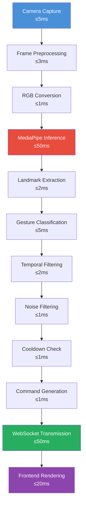
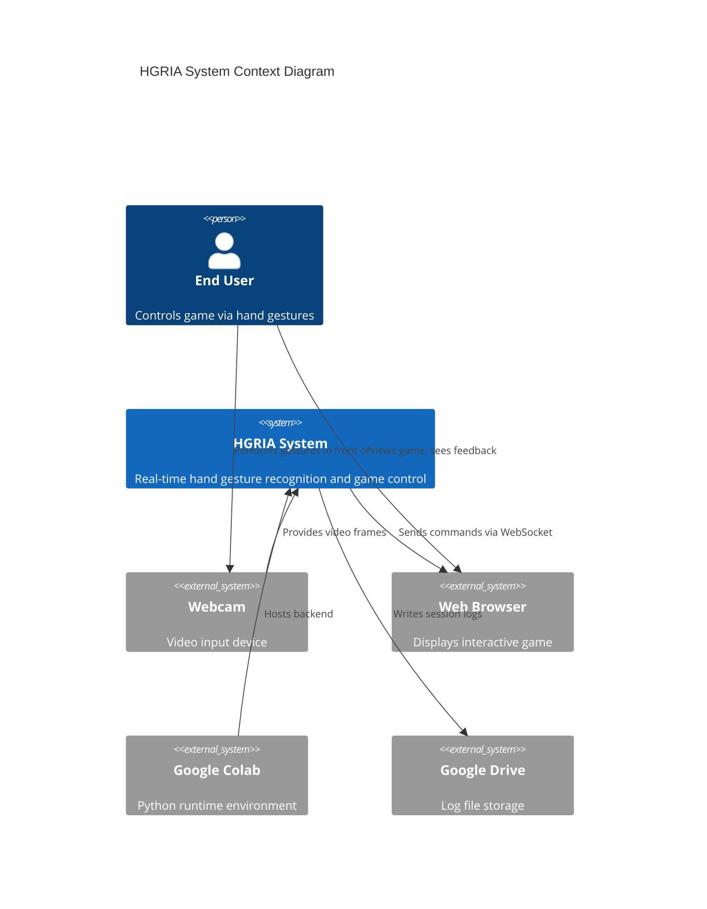
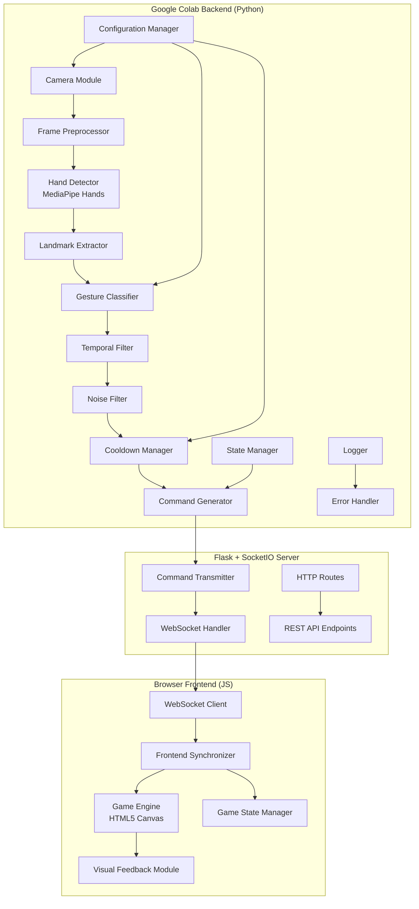
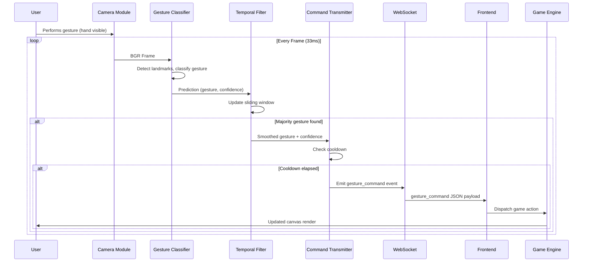
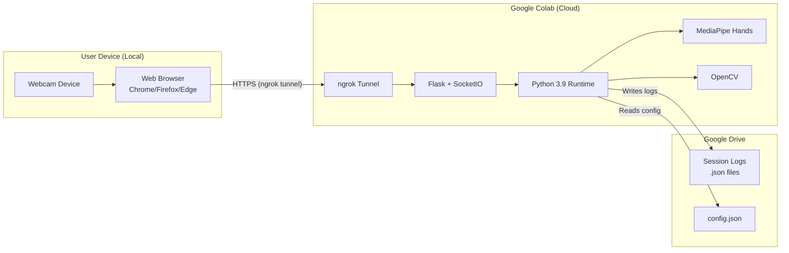
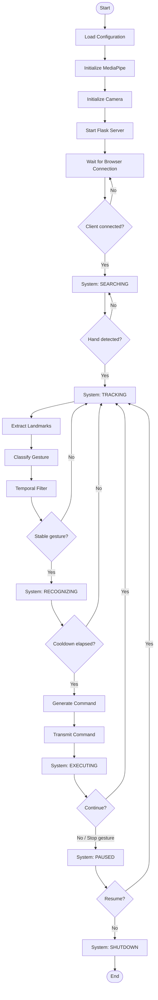
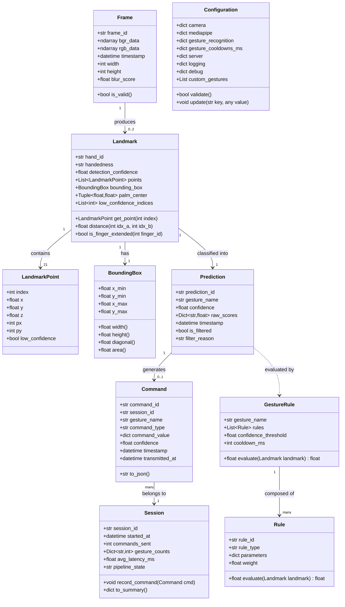
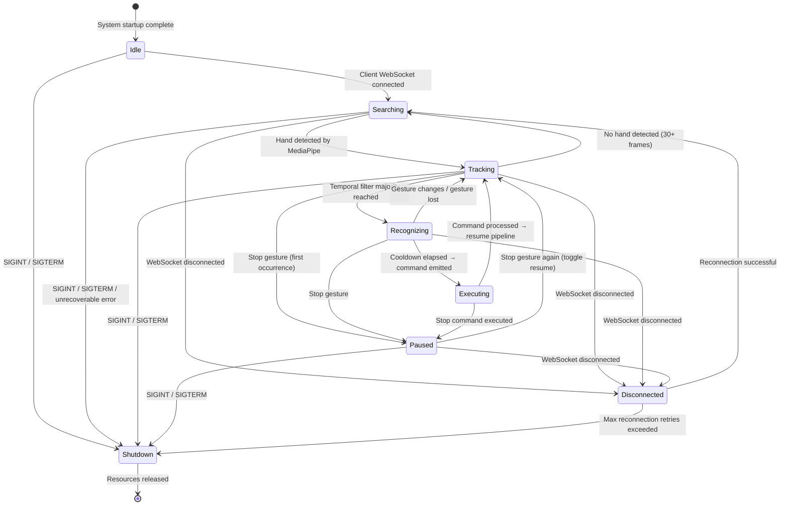

# Software Requirements Specification (SRS)
# Hand Gesture Recognition for Interactive Applications

**Document ID:** SRS-HGRIA-001  
**Version:** 1.0.0  
**Status:** Draft  
**Date:** 2025-07-13  
**Feature Name:** hand-gesture-recognition  

---

## Table of Contents

1. [Executive Summary](#1-executive-summary)
2. [Problem Statement](#2-problem-statement)
3. [Stakeholders](#3-stakeholders)
4. [Project Scope](#4-project-scope)
5. [Functional Requirements](#5-functional-requirements)
6. [Gesture Recognition Specification](#6-gesture-recognition-specification)
7. [Gesture Mapping Table](#7-gesture-mapping-table)
8. [AI Processing Pipeline](#8-ai-processing-pipeline)
9. [System Architecture](#9-system-architecture)
10. [Backend Requirements](#10-backend-requirements)
11. [Frontend Requirements](#11-frontend-requirements)
12. [Non-Functional Requirements](#12-non-functional-requirements)
13. [Performance Targets](#13-performance-targets)
14. [Security Requirements](#14-security-requirements)
15. [Error Handling](#15-error-handling)
16. [Configuration](#16-configuration)
17. [Data Model](#17-data-model)
18. [State Machine](#18-state-machine)
19. [Testing Requirements](#19-testing-requirements)
20. [Acceptance Criteria](#20-acceptance-criteria)
21. [Risks](#21-risks)
22. [Future Roadmap](#22-future-roadmap)
23. [Project Folder Structure](#23-project-folder-structure)
24. [Development Milestones](#24-development-milestones)
25. [Appendix](#25-appendix)

---

## 1. Executive Summary

### 1.1 Purpose

This Software Requirements Specification (SRS) defines the complete, implementation-ready requirements for the Hand Gesture Recognition for Interactive Applications (HGRIA) system. The document specifies functional and non-functional requirements, architecture, data models, testing requirements, and acceptance criteria for a real-time hand gesture recognition pipeline that uses computer vision to translate physical hand gestures into commands for a browser-based interactive application or game.

### 1.2 Business Goals

- Provide a fully functional, demonstrable prototype of a Human-Computer Interaction (HCI) system using only commodity hardware (webcam) and freely available open-source libraries.
- Eliminate the need for physical input peripherals (keyboard, mouse, gamepad) for interaction with browser-based applications.
- Demonstrate end-to-end integration of a Python-based AI inference pipeline with a JavaScript frontend over a WebSocket communication layer.
- Achieve gesture recognition latency low enough for real-time interactive use (end-to-end command latency ≤ 150 ms under nominal conditions).
- Deliver a system that is deployable on Google Colab with no paid services required.

### 1.3 Educational Goals

- Demonstrate practical application of MediaPipe Hands landmark detection in a real-world interaction context.
- Illustrate the full pipeline from sensor input (webcam frame) to application response (game command), covering computer vision, signal processing, backend development, and frontend rendering.
- Show how temporal filtering and confidence thresholds are used to stabilize noisy AI predictions.
- Provide a reference architecture for HCI projects combining Python AI inference with browser frontends.
- Serve as a learning resource for students studying Computer Vision, HCI, and Full-Stack Development.

### 1.4 Scope

The HGRIA system encompasses:

- A Python-based gesture recognition backend running in Google Colab (or any environment with Python 3.9+, OpenCV, and MediaPipe).
- A Flask server that bridges the AI pipeline to the frontend over WebSocket.
- A browser-based frontend (HTML5 Canvas, CSS, JavaScript) that renders a simple interactive game or control panel.
- Support for up to ten (10) predefined hand gestures recognized from a single webcam input stream.
- Real-time command transmission to the frontend with end-to-end latency under 150 ms.

This SRS does not cover mobile native applications, multi-user simultaneous sessions, or cloud deployment beyond Colab-hosted Flask.

### 1.5 Expected Outcome

At project completion, a user sitting in front of a standard webcam will be able to:

1. Launch the system from Google Colab with a single cell execution.
2. Open a browser tab to the Flask-served frontend.
3. Control a simple browser game (e.g., a snake game or interactive control panel) entirely through hand gestures, with visual confirmation of each recognized gesture displayed in the browser.
4. Achieve smooth, real-time interaction with gesture recognition accuracy ≥ 85% for the defined gesture set under standard indoor lighting conditions.

---

## 2. Problem Statement

### 2.1 Current Methods and Limitations

Traditional Human-Computer Interaction relies on physical input devices: keyboards, mice, touchscreens, and gamepads. These devices share common limitations in specific contexts:

| Limitation | Detail |
|---|---|
| Physical contact required | Devices must be touched or pressed, preventing touchless control in hygienic or accessibility-constrained environments. |
| Hardware dependency | Users must own or have access to a specific peripheral. |
| Learning curve | Keyboard shortcuts and complex input mappings require memorization. |
| Accessibility barriers | Users with motor impairments may struggle with fine-grained keyboard/mouse control. |
| Lack of naturalness | Device-based interaction does not map intuitively to spatial or gestural intent. |

Existing gesture-based solutions either require expensive specialized hardware (e.g., Microsoft Kinect, Leap Motion) or rely on heavyweight ML frameworks with high hardware requirements, making them inaccessible for educational or low-resource settings.

### 2.2 Why Gesture Interaction

Hand gesture recognition through commodity webcams addresses the above limitations:

- **Hardware-free**: Only a standard webcam (built into most laptops) is needed.
- **Natural input**: Gestures like pointing, pinching, or raising a thumb are intuitive and require no training for casual users.
- **Touchless control**: Useful in environments where hygiene or physical contact is a concern.
- **Accessible**: Gestures can be adapted to accommodate a range of motor abilities.
- **Educational value**: Demonstrates real-world application of computer vision and machine learning.

### 2.3 Benefits

- Removes the need for additional hardware beyond a webcam.
- Enables interaction with browser applications on any device with a camera.
- Provides a low-latency, real-time interaction modality when properly optimized.
- Serves as a foundation for more advanced gesture vocabularies or sign-language recognition.

### 2.4 Real-World Applications

- **Gaming**: Gesture-controlled browser games as demonstrated in this project.
- **Presentations**: Gesture-based slide navigation (point left/right = previous/next slide).
- **Accessibility tools**: Alternative input for users with limited keyboard/mouse capability.
- **Smart home interfaces**: Controlling home automation through gestures in front of a camera.
- **Educational software**: Interactive lessons controlled by student hand gestures.
- **Healthcare**: Touchless interaction with medical imaging systems.

---

## 3. Stakeholders

### 3.1 Student / Researcher

| Attribute | Detail |
|---|---|
| **Role** | Primary developer and researcher |
| **Goals** | Build a functional HCI prototype; learn MediaPipe, Flask, WebSocket, and browser-based game development; produce a demonstrable project. |
| **Responsibilities** | Implement all pipeline components, write tests, document the system, conduct demos. |
| **Permissions** | Full read/write access to all source code, configuration, and Google Colab notebook. |
| **Success Criteria** | System runs end-to-end with gestures controlling the game; recognition accuracy ≥ 85%; latency ≤ 150 ms. |

### 3.2 Developer (Future Contributor)

| Attribute | Detail |
|---|---|
| **Role** | Engineer extending or maintaining the system after initial delivery. |
| **Goals** | Understand existing architecture quickly; add new gestures or game modes; fix bugs; improve accuracy. |
| **Responsibilities** | Write code compliant with existing standards; add tests for new features; update documentation. |
| **Permissions** | Read/write access to source code; read access to SRS; write access after code review. |
| **Success Criteria** | Can add a new gesture in ≤ 2 hours using the existing gesture specification template. |

### 3.3 End User

| Attribute | Detail |
|---|---|
| **Role** | Person interacting with the browser game using hand gestures. |
| **Goals** | Control the game intuitively; experience low-latency, accurate gesture recognition. |
| **Responsibilities** | Sit within the camera field of view; maintain adequate lighting; grant browser camera permission. |
| **Permissions** | Read access to frontend; no write access to backend configuration. |
| **Success Criteria** | Can learn all gesture mappings within 5 minutes; experiences ≤ 150 ms command latency. |

### 3.4 Instructor / Evaluator

| Attribute | Detail |
|---|---|
| **Role** | Academic supervisor or technical evaluator assessing the project. |
| **Goals** | Evaluate technical depth, code quality, HCI design, and demonstration quality. |
| **Responsibilities** | Review documentation, run the demo, assess against acceptance criteria. |
| **Permissions** | Read access to all source code, documentation, and this SRS. |
| **Success Criteria** | Project demonstrates end-to-end gesture-to-game-command pipeline; documentation is complete and traceable. |

### 3.5 Future Maintainer

| Attribute | Detail |
|---|---|
| **Role** | Engineer maintaining the project after the original developer has moved on. |
| **Goals** | Understand system well enough to fix bugs and upgrade dependencies. |
| **Responsibilities** | Maintain test coverage; update dependencies; fix regressions. |
| **Permissions** | Full read/write access to source code and documentation. |
| **Success Criteria** | Can identify the root cause of any production bug within 30 minutes using logs and documentation. |

---

## 4. Project Scope

### 4.1 In Scope

- Real-time capture of webcam frames using OpenCV running in Google Colab.
- Hand landmark detection using MediaPipe Hands for up to two hands simultaneously.
- Rule-based gesture classification for ten (10) predefined gestures.
- Temporal filtering (sliding window smoothing) of gesture predictions over five (5) consecutive frames.
- Gesture cooldown enforcement to prevent command flooding.
- Flask HTTP + WebSocket server hosted in Google Colab, accessible via ngrok or Colab port forwarding.
- Browser-based frontend serving an HTML5 Canvas game or interactive control panel.
- Real-time command delivery from backend to frontend over WebSocket.
- Visual feedback in the browser: current gesture name, confidence score, FPS, connection status.
- Configurable parameters via a JSON configuration file.
- Structured logging at INFO and DEBUG levels.
- Unit tests for gesture classification logic.
- Integration tests for WebSocket command transmission.
- Project documentation including this SRS and inline code documentation.
- Local JSON file for gesture-to-command mapping configuration.
- Google Drive integration for saving session logs from Colab.

### 4.2 Out of Scope

- Native mobile applications (iOS, Android).
- Multi-user simultaneous WebSocket sessions.
- Cloud deployment to production services (AWS, GCP, Azure, Heroku).
- Custom-trained ML model for gesture classification (rule-based only in this version).
- Voice recognition or multimodal input.
- 3D gesture recognition (depth cameras, stereo vision).
- Sign language recognition beyond the defined gesture vocabulary.
- Persistent user accounts or authentication systems.
- Automated camera calibration for non-standard camera setups.
- Hardware peripheral emulation (e.g., virtual keyboard/mouse via gestures).

### 4.3 Future Enhancements

- ML-based gesture classifier trained on custom dataset (see Section 22).
- Additional gesture vocabulary (see Section 22).
- Mobile web support with on-device MediaPipe inference.
- Multi-user collaborative gesture control.
- AR/VR gesture interface integration.
- Sign language alphabet recognition.
- Cloud-native deployment with container orchestration.

### 4.4 Constraints

| Constraint | Detail |
|---|---|
| **Runtime environment** | Primary execution environment is Google Colab (Python 3.9+, GPU/CPU runtime). |
| **Camera access** | Google Colab does not natively support webcam capture; JavaScript-based frame capture and forwarding to Python is required (via Colab's JavaScript bridge or OpenCV with a virtual device). |
| **Colab session limits** | Free Colab sessions have a maximum idle timeout of 90 minutes and a maximum session length of 12 hours. |
| **Network access** | The Flask server must be exposed to the internet via ngrok or Colab's built-in port forwarding for browser access. |
| **No GPU requirement** | The system must function on CPU-only Colab runtime; GPU acceleration is optional. |
| **Browser compatibility** | The frontend must function in Chrome 100+, Firefox 100+, and Edge 100+. |
| **Open source only** | All dependencies must be open-source with permissive licenses (MIT, Apache 2.0, BSD). |
| **No paid services** | No paid APIs, cloud services, or licensed software may be used. |

### 4.5 Assumptions

- The user has a functioning webcam accessible to the browser.
- The user's environment has adequate lighting (minimum 100 lux ambient lighting).
- The user's hand is within 30–80 cm of the camera during gesture performance.
- A single user performs gestures at any given time (single-user mode).
- The browser has WebSocket support enabled (all modern browsers do).
- The user has granted camera permission to the browser.
- Google Colab has internet access to install dependencies on first run.
- The user has a Google account for Colab and Google Drive access.
- MediaPipe Hands model files are downloaded automatically by the `mediapipe` Python package.

---

## 5. Functional Requirements

Each requirement follows the format: **ID | Priority | Description | Input | Processing | Output | Acceptance Criteria | Dependencies**.

Priority levels: **P1** = Must Have, **P2** = Should Have, **P3** = Nice to Have.

---

### FR-001: System Startup

**Priority:** P1  
**Description:** THE System SHALL initialize all subsystems in the correct startup sequence when the user executes the Colab notebook launch cell.

| Attribute | Detail |
|---|---|
| **Input** | User executes the Colab launch cell; configuration file path provided as parameter. |
| **Processing** | Load configuration from JSON file; validate all configuration parameters; initialize Logger; initialize MediaPipe Hands model; initialize Camera; initialize Flask server; initialize WebSocket server; wait for browser client connection. |
| **Output** | All subsystems report `READY` status; system enters `Searching` state; startup log entry written. |
| **Acceptance Criteria** | 1. THE System SHALL complete startup within 15 seconds on a standard Colab CPU runtime. 2. IF any subsystem fails to initialize, THEN THE System SHALL log the failure with error details and halt startup with a descriptive error message. 3. THE System SHALL log the Flask server URL and WebSocket URL to the console on successful startup. |
| **Dependencies** | FR-002, FR-003, FR-004, FR-005 |

---

### FR-002: Initialize MediaPipe Hands

**Priority:** P1  
**Description:** THE MediaPipe_Initializer SHALL load and configure the MediaPipe Hands model with parameters from the system configuration.

| Attribute | Detail |
|---|---|
| **Input** | Configuration parameters: `min_detection_confidence`, `min_tracking_confidence`, `max_num_hands`, `model_complexity`. |
| **Processing** | Instantiate `mediapipe.solutions.hands.Hands` with provided parameters; verify model files are available; perform a warmup inference on a blank frame. |
| **Output** | MediaPipe Hands instance ready to process frames; initialization status `READY`. |
| **Acceptance Criteria** | 1. THE MediaPipe_Initializer SHALL load the model within 10 seconds. 2. IF model files are unavailable, THEN THE MediaPipe_Initializer SHALL attempt automatic download and retry once. 3. THE MediaPipe_Initializer SHALL use `min_detection_confidence = 0.7` and `min_tracking_confidence = 0.5` as defaults when not specified in configuration. 4. WHEN warmup inference completes, THE MediaPipe_Initializer SHALL log inference time in milliseconds. |
| **Dependencies** | Configuration loaded (FR-016) |

---

### FR-003: Initialize Webcam

**Priority:** P1  
**Description:** THE Camera_Module SHALL initialize the webcam capture stream at the configured resolution and frame rate.

| Attribute | Detail |
|---|---|
| **Input** | Configuration parameters: `camera_index`, `frame_width`, `frame_height`, `target_fps`. |
| **Processing** | Open video capture using `cv2.VideoCapture(camera_index)`; set frame width, height, and FPS properties; verify camera opens successfully by reading one test frame. |
| **Output** | Active `VideoCapture` object; actual resolution and FPS logged. |
| **Acceptance Criteria** | 1. THE Camera_Module SHALL open the camera within 5 seconds. 2. IF the camera fails to open, THEN THE Camera_Module SHALL log the error with the camera index and raise a `CameraInitializationError`. 3. THE Camera_Module SHALL accept a configuration override for camera index to support multiple attached cameras. 4. WHEN operating in Google Colab, THE Camera_Module SHALL support JavaScript-based frame injection as an alternative to direct device capture. |
| **Dependencies** | Configuration loaded (FR-016) |

---

### FR-004: Initialize Flask Server

**Priority:** P1  
**Description:** THE Flask_Server SHALL start an HTTP and WebSocket server on the configured host and port.

| Attribute | Detail |
|---|---|
| **Input** | Configuration parameters: `server_host`, `server_port`, `websocket_path`, `cors_origins`. |
| **Processing** | Create Flask application instance; configure CORS with allowed origins; register HTTP routes; initialize `flask_socketio.SocketIO` instance; start the server in a background thread. |
| **Output** | Server listening on `http://{host}:{port}`; WebSocket endpoint available at `ws://{host}:{port}{websocket_path}`; server URL logged to console. |
| **Acceptance Criteria** | 1. THE Flask_Server SHALL start within 5 seconds of invocation. 2. THE Flask_Server SHALL respond to `GET /health` with HTTP 200 and `{"status": "ok"}` within 100 ms. 3. IF the configured port is already in use, THEN THE Flask_Server SHALL log the conflict and increment the port by 1 up to three times before raising a `ServerStartupError`. 4. THE Flask_Server SHALL log the full public URL (including ngrok tunnel URL if available) on successful startup. |
| **Dependencies** | Configuration loaded (FR-016) |

---

### FR-005: Initialize Browser Client

**Priority:** P1  
**Description:** THE Browser_Client SHALL load the frontend application and establish a WebSocket connection to the Flask server.

| Attribute | Detail |
|---|---|
| **Input** | User opens the server URL in a browser; HTML/CSS/JS files served from Flask static folder. |
| **Processing** | Browser loads `index.html`; JavaScript establishes WebSocket connection to server; client sends `client_ready` event; server acknowledges with `server_info` event containing session ID and configuration. |
| **Output** | WebSocket connection established; `connection_status` UI element shows `Connected`; frontend ready to receive commands. |
| **Acceptance Criteria** | 1. THE Browser_Client SHALL establish a WebSocket connection within 3 seconds of page load on a local network. 2. IF the WebSocket connection fails, THEN THE Browser_Client SHALL display a `Disconnected` status and retry connection every 5 seconds up to 10 times. 3. THE Browser_Client SHALL display the server address and session ID in the debug panel when `debug_mode` is enabled. 4. WHEN the connection is established, THE Browser_Client SHALL display the gesture mapping guide to the user. |
| **Dependencies** | FR-004 |

---

### FR-006: Initialize Game

**Priority:** P1  
**Description:** THE Game_Engine SHALL initialize the HTML5 Canvas game with default state and render the initial game frame.

| Attribute | Detail |
|---|---|
| **Input** | WebSocket connection established; `server_info` event received. |
| **Processing** | Initialize game state variables (score = 0, lives = 3, level = 1, position = start); set up Canvas rendering context; start game loop at configured FPS; render initial game frame. |
| **Output** | Game canvas rendered with initial state; game loop running; FPS counter visible in debug panel. |
| **Acceptance Criteria** | 1. THE Game_Engine SHALL render the first frame within 500 ms of connection establishment. 2. THE Game_Engine SHALL maintain a game loop running at the configured target FPS (default: 30 FPS). 3. THE Game_Engine SHALL display player score, lives, level, and connection status in the HUD at all times. 4. WHEN the game is initialized, THE Game_Engine SHALL display a `Ready — show a gesture to start` message on the canvas. |
| **Dependencies** | FR-005 |

---

### FR-007: Hand Detection

**Priority:** P1  
**Description:** WHEN a new camera frame is available, THE Hand_Detector SHALL detect the presence and location of up to two hands in the frame.

| Attribute | Detail |
|---|---|
| **Input** | BGR frame from Camera_Module (numpy ndarray, shape HxWx3). |
| **Processing** | Convert frame from BGR to RGB; pass RGB frame to `mediapipe.solutions.hands.Hands.process()`; extract `multi_hand_landmarks` and `multi_handedness` from results. |
| **Output** | List of detected hands, each containing: handedness label (`Left`/`Right`), detection confidence score, list of 21 landmark coordinates (x, y, z normalized). Returns empty list if no hands detected. |
| **Acceptance Criteria** | 1. THE Hand_Detector SHALL process each frame within 50 ms on a standard Colab CPU runtime. 2. THE Hand_Detector SHALL detect hands in frames where a hand occupies at least 10% of the frame area. 3. IF no hand is detected in a frame, THE Hand_Detector SHALL return an empty result and log a `no_hand_detected` event at DEBUG level. 4. THE Hand_Detector SHALL correctly distinguish Left and Right hands with ≥ 90% accuracy under standard lighting conditions. |
| **Dependencies** | FR-002, FR-003 |

---

### FR-008: Landmark Extraction

**Priority:** P1  
**Description:** WHEN hand landmarks are detected, THE Landmark_Extractor SHALL extract and normalize the 21 hand landmark coordinates into a structured data object.

| Attribute | Detail |
|---|---|
| **Input** | Raw MediaPipe `NormalizedLandmarkList` for a detected hand. |
| **Processing** | Extract x, y, z coordinates for all 21 landmarks; convert normalized coordinates (0.0–1.0) to pixel coordinates for display; compute bounding box of the hand region; compute palm center as midpoint of landmarks 0 and 9. |
| **Output** | `Landmark` data object containing: 21 `(x, y, z)` tuples in normalized space, 21 `(px, py)` tuples in pixel space, bounding box `(x_min, y_min, x_max, y_max)` in pixel space, palm center `(cx, cy)`. |
| **Acceptance Criteria** | 1. THE Landmark_Extractor SHALL produce exactly 21 landmark entries for every detected hand. 2. THE Landmark_Extractor SHALL normalize all coordinate values to the range [0.0, 1.0]. 3. THE Landmark_Extractor SHALL compute bounding box coordinates that fully enclose all 21 landmarks with a 10-pixel padding. 4. IF a landmark's confidence is below 0.5, THE Landmark_Extractor SHALL flag that landmark as `low_confidence`. |
| **Dependencies** | FR-007 |

---

### FR-009: Gesture Classification

**Priority:** P1  
**Description:** WHEN landmarks are extracted for a hand, THE Gesture_Classifier SHALL classify the hand pose into one of the predefined gesture categories or `UNKNOWN`.

| Attribute | Detail |
|---|---|
| **Input** | `Landmark` data object from FR-008; gesture rule definitions from configuration. |
| **Processing** | For each defined gesture, evaluate geometric rules against landmark positions (finger extension states, relative positions, angles); compute rule match score; select gesture with highest score above confidence threshold; return `UNKNOWN` if no gesture exceeds threshold. |
| **Output** | `Prediction` object: `gesture_name` (string), `confidence` (float, 0.0–1.0), `raw_scores` (dict mapping gesture name to score), `timestamp` (UTC). |
| **Acceptance Criteria** | 1. THE Gesture_Classifier SHALL evaluate all ten (10) defined gestures per frame. 2. THE Gesture_Classifier SHALL return the gesture with the highest score if that score exceeds the configured `confidence_threshold` (default: 0.75). 3. IF no gesture score exceeds the threshold, THE Gesture_Classifier SHALL return `UNKNOWN` with confidence 0.0. 4. THE Gesture_Classifier SHALL complete classification within 5 ms per hand per frame. 5. THE Gesture_Classifier SHALL achieve ≥ 85% accuracy on the predefined gesture test dataset. |
| **Dependencies** | FR-008 |

---

### FR-010: Gesture Confidence Scoring

**Priority:** P1  
**Description:** THE Confidence_Scorer SHALL compute a normalized confidence score for each gesture prediction based on how closely the detected landmarks match the gesture definition.

| Attribute | Detail |
|---|---|
| **Input** | Landmark data; gesture rule definitions; per-rule tolerance values. |
| **Processing** | For each rule in a gesture definition, compute a soft score (0.0–1.0) based on how close the measured value is to the ideal value within the tolerance range; aggregate per-rule scores using weighted average; normalize to [0.0, 1.0]. |
| **Output** | Confidence score (float, 0.0–1.0) per gesture. |
| **Acceptance Criteria** | 1. THE Confidence_Scorer SHALL produce scores in the range [0.0, 1.0] for all inputs. 2. A perfect gesture match SHALL produce a confidence score ≥ 0.95. 3. THE Confidence_Scorer SHALL use configurable per-gesture confidence thresholds. 4. THE Confidence_Scorer SHALL log raw scores at DEBUG level for all gestures in every frame when `debug_mode` is enabled. |
| **Dependencies** | FR-009 |

---

### FR-011: Gesture Smoothing (Temporal Filtering)

**Priority:** P1  
**Description:** THE Temporal_Filter SHALL smooth gesture predictions over a configurable sliding window to reduce noise and flickering in the recognized gesture stream.

| Attribute | Detail |
|---|---|
| **Input** | Stream of `Prediction` objects from FR-009; configuration parameter `smoothing_window_size` (default: 5). |
| **Processing** | Maintain a circular buffer of the last N predictions; count occurrences of each gesture in the buffer; return the gesture that appears in the majority (> 50%) of the last N frames; if no majority, return `UNKNOWN`. |
| **Output** | Smoothed gesture name (string); smoothed confidence (float, mean confidence of majority-gesture frames). |
| **Acceptance Criteria** | 1. THE Temporal_Filter SHALL use a configurable sliding window of 3–10 frames. 2. A gesture MUST appear in at least (window_size / 2 + 1) consecutive frames before being emitted as the smoothed gesture. 3. THE Temporal_Filter SHALL introduce no more than (window_size / target_fps) seconds of additional latency. 4. WHEN the gesture changes, THE Temporal_Filter SHALL reset the buffer and begin accumulating for the new gesture. |
| **Dependencies** | FR-009, FR-010 |

---

### FR-012: Noise Filtering

**Priority:** P2  
**Description:** THE Noise_Filter SHALL reject gesture predictions that result from hand occlusion, partial visibility, or low-quality frames.

| Attribute | Detail |
|---|---|
| **Input** | `Prediction` object; `Landmark` data with `low_confidence` flags; frame quality metrics (brightness, blur score). |
| **Processing** | Reject prediction if more than 3 landmarks are flagged `low_confidence`; reject prediction if frame blur score (Laplacian variance) < configured threshold; reject prediction if hand bounding box is less than 5% of frame area; pass prediction to Temporal_Filter otherwise. |
| **Output** | Filtered `Prediction` object or `FILTERED` status. |
| **Acceptance Criteria** | 1. THE Noise_Filter SHALL reject predictions where more than 3 of 21 landmarks have `low_confidence`. 2. THE Noise_Filter SHALL compute frame sharpness using Laplacian variance and reject predictions when variance < 100. 3. THE Noise_Filter SHALL log the reason for each rejection at DEBUG level. 4. THE Noise_Filter SHALL not introduce more than 1 ms of processing latency per frame. |
| **Dependencies** | FR-008, FR-009 |

---

### FR-013: Gesture Cooldown

**Priority:** P1  
**Description:** THE Cooldown_Manager SHALL enforce a minimum time interval between consecutive command emissions for the same gesture to prevent command flooding.

| Attribute | Detail |
|---|---|
| **Input** | Smoothed gesture from FR-011; timestamp; per-gesture cooldown configuration (default: 500 ms). |
| **Processing** | Record timestamp of last emission for each gesture; when a smoothed gesture is stable, check if time since last emission exceeds the gesture's configured cooldown; if cooldown has elapsed, emit command; otherwise discard. |
| **Output** | `Command` object if cooldown elapsed; no output if cooldown active. |
| **Acceptance Criteria** | 1. THE Cooldown_Manager SHALL enforce a minimum inter-command interval per gesture (default: 500 ms, configurable per gesture). 2. THE Cooldown_Manager SHALL allow different cooldown values per gesture (e.g., directional gestures may use 300 ms; stop gestures may use 1000 ms). 3. WHEN a cooldown is active, THE Cooldown_Manager SHALL NOT emit a command for that gesture. 4. THE Cooldown_Manager SHALL log cooldown activation and expiration events at DEBUG level. |
| **Dependencies** | FR-011 |

---

### FR-014: Gesture State Management

**Priority:** P1  
**Description:** THE State_Manager SHALL maintain and transition the system's operational state based on gesture detection events and system events.

| Attribute | Detail |
|---|---|
| **Input** | Events: gesture detected, no hand detected, command emitted, pause requested, connection lost. |
| **Processing** | Apply state transition rules as defined in Section 18; notify registered listeners on state change; enforce valid transitions only. |
| **Output** | Current system state (one of: `Idle`, `Searching`, `Tracking`, `Recognizing`, `Executing`, `Paused`, `Disconnected`, `Shutdown`). |
| **Acceptance Criteria** | 1. THE State_Manager SHALL reject invalid state transitions and log a warning. 2. THE State_Manager SHALL notify all registered listeners within 5 ms of a state change. 3. THE State_Manager SHALL persist the last known state to the log on shutdown. 4. WHEN the state enters `Disconnected`, THE State_Manager SHALL attempt reconnection as defined in FR-005. |
| **Dependencies** | FR-007, FR-011, FR-013 |

---

### FR-015: Command Generation

**Priority:** P1  
**Description:** WHEN a gesture passes cooldown validation, THE Command_Generator SHALL produce a structured command object mapped from the gesture name.

| Attribute | Detail |
|---|---|
| **Input** | Gesture name (string); gesture-to-command mapping from configuration. |
| **Processing** | Look up the gesture in the command mapping table; create a `Command` object with: `command_id` (UUID), `gesture_name`, `command_type`, `command_value`, `timestamp`, `session_id`. |
| **Output** | `Command` object ready for transmission. |
| **Acceptance Criteria** | 1. THE Command_Generator SHALL produce a unique `command_id` (UUID4) for every command. 2. THE Command_Generator SHALL reject gestures not in the command mapping with a `UNMAPPED_GESTURE` error. 3. THE Command_Generator SHALL include session metadata in every command. 4. THE Command_Generator SHALL complete command creation within 1 ms. |
| **Dependencies** | FR-013, Configuration (FR-016) |

---

### FR-016: Configuration Management

**Priority:** P1  
**Description:** THE Configuration_Manager SHALL load, validate, and provide access to all system configuration parameters from a JSON file.

| Attribute | Detail |
|---|---|
| **Input** | Path to `config.json` file; optional environment variable overrides. |
| **Processing** | Read and parse JSON file; validate all required fields are present; validate value types and ranges; merge environment variable overrides (ENV vars take precedence over file); expose config as immutable named properties. |
| **Output** | Validated `Configuration` object accessible to all subsystems. |
| **Acceptance Criteria** | 1. THE Configuration_Manager SHALL load configuration at startup before any other subsystem is initialized. 2. IF the configuration file is missing, THE Configuration_Manager SHALL use built-in defaults and log a warning. 3. IF any configuration value is out of range, THE Configuration_Manager SHALL reject the value, log the error, and use the default. 4. THE Configuration_Manager SHALL support hot-reload of non-critical parameters (logging level, debug mode) via a `SIGHUP` signal or API endpoint. |
| **Dependencies** | None |

---

### FR-017: Command Transmission

**Priority:** P1  
**Description:** WHEN a command is generated, THE Command_Transmitter SHALL send the command to all connected browser clients over WebSocket.

| Attribute | Detail |
|---|---|
| **Input** | `Command` object from FR-015. |
| **Processing** | Serialize `Command` to JSON; emit WebSocket event `gesture_command` with serialized payload to all connected clients in the session room; record transmission timestamp; log transmission at INFO level. |
| **Output** | Command delivered to frontend; transmission latency logged. |
| **Acceptance Criteria** | 1. THE Command_Transmitter SHALL deliver commands to connected clients within 50 ms of command creation on a local network. 2. IF no client is connected, THE Command_Transmitter SHALL buffer up to 10 commands and deliver them on client reconnection. 3. THE Command_Transmitter SHALL log each command transmission with command_id, gesture_name, and transmission latency. 4. THE Command_Transmitter SHALL discard buffered commands older than 5 seconds when the client reconnects. |
| **Dependencies** | FR-004, FR-015 |

---

### FR-018: Frontend Synchronization

**Priority:** P1  
**Description:** WHEN the frontend receives a `gesture_command` WebSocket event, THE Frontend_Synchronizer SHALL parse the command and dispatch it to the appropriate game handler.

| Attribute | Detail |
|---|---|
| **Input** | `gesture_command` WebSocket event with JSON payload. |
| **Processing** | Parse JSON payload; validate command structure; look up corresponding game action in client-side command mapping; dispatch action to Game_Engine; update gesture display in HUD. |
| **Output** | Game action dispatched; HUD updated with current gesture name and confidence. |
| **Acceptance Criteria** | 1. THE Frontend_Synchronizer SHALL process incoming commands within 5 ms of WebSocket message receipt. 2. THE Frontend_Synchronizer SHALL display the current gesture name and confidence score in the HUD for at least 1 second after receipt. 3. IF an unknown command is received, THE Frontend_Synchronizer SHALL log a warning and ignore the command. 4. THE Frontend_Synchronizer SHALL update the latency display with end-to-end latency (command timestamp to receipt time). |
| **Dependencies** | FR-017, FR-005 |

---

### FR-019: Game Update

**Priority:** P1  
**Description:** WHEN the Game_Engine receives a game action, THE Game_Engine SHALL update the game state and render the result on the HTML5 Canvas.

| Attribute | Detail |
|---|---|
| **Input** | Game action (string) from Frontend_Synchronizer. |
| **Processing** | Map action to game state mutation (move left, move right, jump, pause, etc.); apply mutation to game state; check win/loss conditions; render updated state on Canvas; play associated sound effect if enabled. |
| **Output** | Updated Canvas render; updated score/lives/level in HUD; game-over or level-complete screen if applicable. |
| **Acceptance Criteria** | 1. THE Game_Engine SHALL apply a game state mutation within 1 frame (≤ 33 ms at 30 FPS). 2. THE Game_Engine SHALL render at a minimum of 30 FPS under nominal conditions. 3. WHEN a game-over condition is reached, THE Game_Engine SHALL display a game-over screen with final score and a restart prompt. 4. THE Game_Engine SHALL respond to a `PAUSE` command by suspending the game loop until a `RESUME` command is received. |
| **Dependencies** | FR-018 |

---

### FR-020: Visual Feedback

**Priority:** P1  
**Description:** THE Visual_Feedback_Module SHALL display real-time gesture recognition status in the browser UI at all times.

| Attribute | Detail |
|---|---|
| **Input** | Current gesture name; confidence score; system state; FPS; WebSocket latency; connection status. |
| **Processing** | Render overlay panel on canvas (or sidebar panel) showing: recognized gesture name, confidence bar, system state, FPS counter, WebSocket round-trip latency, connection indicator (green/red). |
| **Output** | Updated HUD overlay on every frame. |
| **Acceptance Criteria** | 1. THE Visual_Feedback_Module SHALL update the gesture name display within 100 ms of a gesture change. 2. THE Visual_Feedback_Module SHALL display a confidence bar that visually represents the confidence score from 0% to 100%. 3. THE Visual_Feedback_Module SHALL use color coding: green for confidence ≥ 75%, yellow for 50–74%, red for < 50%. 4. THE Visual_Feedback_Module SHALL display a gesture icon or label from the gesture mapping guide. |
| **Dependencies** | FR-018 |

---

### FR-021: Logging

**Priority:** P1  
**Description:** THE Logger SHALL write structured log entries for all significant system events to console output and optionally to a log file.

| Attribute | Detail |
|---|---|
| **Input** | Log event: level (DEBUG/INFO/WARNING/ERROR), module name, message, optional structured data (dict). |
| **Processing** | Format log entry as JSON with fields: `timestamp`, `level`, `module`, `message`, `data`; write to console (stdout); if `log_to_file` is enabled, append to log file on Google Drive. |
| **Output** | Formatted log entry in console and/or file. |
| **Acceptance Criteria** | 1. THE Logger SHALL write entries at INFO level and above by default; DEBUG level when `debug_mode` is enabled. 2. THE Logger SHALL write log entries within 1 ms of event occurrence (non-blocking async write). 3. THE Logger SHALL include a UTC timestamp with millisecond precision in every log entry. 4. THE Logger SHALL rotate log files at 10 MB and retain the last 5 rotated files. |
| **Dependencies** | FR-016 |

---

### FR-022: Error Handling

**Priority:** P1  
**Description:** THE Error_Handler SHALL intercept, classify, log, and recover from all runtime errors according to the error handling policy defined in Section 15.

| Attribute | Detail |
|---|---|
| **Input** | Exception or error event from any subsystem. |
| **Processing** | Classify error by type (recoverable / non-recoverable); log error with full stack trace at ERROR level; execute recovery strategy (retry, fallback, halt); notify frontend if error affects user experience. |
| **Output** | System continues operation (recoverable) or shuts down gracefully (non-recoverable); frontend displays error message if applicable. |
| **Acceptance Criteria** | 1. THE Error_Handler SHALL not allow an unhandled exception to terminate the system without a logged stack trace. 2. THE Error_Handler SHALL notify the browser client via WebSocket `system_error` event when a recoverable error occurs. 3. WHEN a non-recoverable error occurs, THE Error_Handler SHALL perform a graceful shutdown releasing camera and server resources before exiting. 4. THE Error_Handler SHALL implement retry logic with exponential backoff for transient network errors. |
| **Dependencies** | FR-021 |

---

### FR-023: Graceful Shutdown

**Priority:** P1  
**Description:** WHEN the user stops the Colab cell or sends a shutdown signal, THE System SHALL release all resources and shut down all subsystems cleanly.

| Attribute | Detail |
|---|---|
| **Input** | `SIGINT`, `SIGTERM`, or user-triggered stop cell execution. |
| **Processing** | Send `server_shutdown` WebSocket event to all connected clients; stop the camera capture loop; release `VideoCapture` object; close MediaPipe Hands instance; stop Flask/SocketIO server; flush and close log files; write session summary to log. |
| **Output** | All resources released; log files closed; session summary written; console message `System shutdown complete`. |
| **Acceptance Criteria** | 1. THE System SHALL complete graceful shutdown within 5 seconds of receiving the shutdown signal. 2. THE System SHALL release the camera resource before shutdown completes. 3. THE System SHALL flush all pending log entries before closing log files. 4. WHEN the shutdown event is received by the browser, THE Browser_Client SHALL display a `Server disconnected — session ended` message. |
| **Dependencies** | FR-003, FR-004, FR-021 |

---

## 6. Gesture Recognition Specification

### Glossary of Landmark Indices

MediaPipe Hands produces 21 landmarks per hand. Key indices:

| Index | Name |
|---|---|
| 0 | WRIST |
| 1 | THUMB_CMC |
| 2 | THUMB_MCP |
| 3 | THUMB_IP |
| 4 | THUMB_TIP |
| 5 | INDEX_MCP |
| 6 | INDEX_PIP |
| 7 | INDEX_DIP |
| 8 | INDEX_TIP |
| 9 | MIDDLE_MCP |
| 10 | MIDDLE_PIP |
| 11 | MIDDLE_DIP |
| 12 | MIDDLE_TIP |
| 13 | RING_MCP |
| 14 | RING_PIP |
| 15 | RING_DIP |
| 16 | RING_TIP |
| 17 | PINKY_MCP |
| 18 | PINKY_PIP |
| 19 | PINKY_DIP |
| 20 | PINKY_TIP |

**Finger Extension Rule:** A finger is considered EXTENDED when its TIP y-coordinate is less than its PIP y-coordinate (i.e., the tip is above the middle joint in a standard upright hand orientation). The thumb uses a lateral comparison: THUMB_TIP x-coordinate vs. THUMB_IP x-coordinate (direction depends on handedness).

---

### GS-001: Open Palm

| Attribute | Detail |
|---|---|
| **Gesture Name** | Open Palm |
| **Description** | All five fingers fully extended and spread apart, palm facing the camera. |
| **Finger States** | Thumb: EXTENDED. Index: EXTENDED. Middle: EXTENDED. Ring: EXTENDED. Pinky: EXTENDED. |
| **Expected Landmarks** | All TIP landmarks (4, 8, 12, 16, 20) have y-coordinates less than their respective MCP landmarks. Finger spread: distance between INDEX_TIP and PINKY_TIP ≥ 40% of hand bounding box width. |
| **Recognition Rules** | R1: All 5 fingers extended. R2: Finger spread ratio ≥ 0.4. R3: Palm facing camera (landmark 9 z-coordinate near 0.0). |
| **Tolerance** | Finger extension: TIP_y < PIP_y − 0.02 (normalized). Spread ratio: ±0.05. |
| **Confidence Threshold** | 0.80 |
| **Cooldown** | 500 ms |
| **Example Image** | `assets/gestures/open_palm.png` (placeholder) |
| **Failure Cases** | Partially bent fingers; hand too close causing distortion; pinky slightly curled. |
| **False Positive Handling** | Require all 5 fingers to pass extension check; fail if any finger TIP_y > PIP_y + 0.02. |
| **Possible Improvements** | Add palm orientation check using normal vector of palm plane. |

---

### GS-002: Closed Fist

| Attribute | Detail |
|---|---|
| **Gesture Name** | Closed Fist |
| **Description** | All five fingers curled inward, forming a fist. |
| **Finger States** | Thumb: CURLED. Index: CURLED. Middle: CURLED. Ring: CURLED. Pinky: CURLED. |
| **Expected Landmarks** | All TIP landmarks (4, 8, 12, 16, 20) have y-coordinates greater than their respective MCP landmarks. Hand bounding box height-to-width ratio ≈ 1.0 (compact fist shape). |
| **Recognition Rules** | R1: All 5 fingers curled (TIP_y > MCP_y). R2: Bounding box aspect ratio between 0.7 and 1.3. R3: All TIP landmarks within 15% of palm center distance. |
| **Tolerance** | TIP_y > MCP_y − 0.02. Aspect ratio: ±0.15. |
| **Confidence Threshold** | 0.82 |
| **Cooldown** | 500 ms |
| **Example Image** | `assets/gestures/closed_fist.png` (placeholder) |
| **Failure Cases** | Thumb not fully curled (common); partial finger curl; hand at angle. |
| **False Positive Handling** | Require at least 4 of 5 fingers to be CURLED; use thumb as secondary discriminator. |
| **Possible Improvements** | Use convexity defect analysis for more robust fist detection. |

---

### GS-003: Point Left

| Attribute | Detail |
|---|---|
| **Gesture Name** | Point Left |
| **Description** | Index finger extended and pointing to the left; all other fingers curled. |
| **Finger States** | Index: EXTENDED. Thumb: CURLED or neutral. Middle: CURLED. Ring: CURLED. Pinky: CURLED. |
| **Expected Landmarks** | INDEX_TIP x-coordinate significantly less than INDEX_MCP x-coordinate (for right hand). INDEX_TIP y-coordinate near INDEX_MCP y-coordinate (horizontal pointing). Non-index TIP landmarks below their MCP landmarks. |
| **Recognition Rules** | R1: Index EXTENDED (TIP_y < PIP_y). R2: Index pointing left: (INDEX_TIP_x - INDEX_MCP_x) < −0.08 (normalized). R3: Middle, Ring, Pinky curled. |
| **Tolerance** | Horizontal deviation: INDEX_TIP_y within ±0.15 of INDEX_MCP_y. Leftward displacement: > 0.06 normalized units. |
| **Confidence Threshold** | 0.78 |
| **Cooldown** | 300 ms |
| **Example Image** | `assets/gestures/point_left.png` (placeholder) |
| **Failure Cases** | Ambiguity with "Point Right" when handedness is wrong; diagonal pointing; thumb extended alongside index. |
| **False Positive Handling** | Require that middle finger TIP_y > MIDDLE_MCP_y; disambiguate using handedness label. |
| **Possible Improvements** | Use angle of index finger vector for more precise directional classification. |

---

### GS-004: Point Right

| Attribute | Detail |
|---|---|
| **Gesture Name** | Point Right |
| **Description** | Index finger extended and pointing to the right; all other fingers curled. |
| **Finger States** | Index: EXTENDED. Thumb: CURLED or neutral. Middle: CURLED. Ring: CURLED. Pinky: CURLED. |
| **Expected Landmarks** | INDEX_TIP x-coordinate significantly greater than INDEX_MCP x-coordinate. INDEX_TIP y-coordinate near INDEX_MCP y-coordinate. |
| **Recognition Rules** | R1: Index EXTENDED (TIP_y < PIP_y). R2: Index pointing right: (INDEX_TIP_x - INDEX_MCP_x) > 0.08. R3: Middle, Ring, Pinky curled. |
| **Tolerance** | Horizontal deviation: ±0.15 normalized units. Rightward displacement: > 0.06 normalized units. |
| **Confidence Threshold** | 0.78 |
| **Cooldown** | 300 ms |
| **Example Image** | `assets/gestures/point_right.png` (placeholder) |
| **Failure Cases** | Same as Point Left but mirrored; confusion with "Victory" if middle finger is partially extended. |
| **False Positive Handling** | Require middle finger TIP_y > MIDDLE_MCP_y; check rightward displacement threshold strictly. |
| **Possible Improvements** | Compute pointing direction vector from MCP→TIP and classify into 8 compass directions. |

---

### GS-005: Thumb Up

| Attribute | Detail |
|---|---|
| **Gesture Name** | Thumb Up |
| **Description** | Thumb extended upward; all other fingers curled into a fist. |
| **Finger States** | Thumb: EXTENDED upward. Index: CURLED. Middle: CURLED. Ring: CURLED. Pinky: CURLED. |
| **Expected Landmarks** | THUMB_TIP y-coordinate significantly less than THUMB_IP y-coordinate (thumb pointing up). Index, Middle, Ring, Pinky TIP landmarks below their MCP landmarks. |
| **Recognition Rules** | R1: Thumb extended upward: THUMB_TIP_y < THUMB_IP_y − 0.05. R2: All four non-thumb fingers curled. R3: THUMB_TIP_y < WRIST_y (thumb above wrist). |
| **Tolerance** | Upward displacement: THUMB_TIP_y < THUMB_IP_y − 0.03. |
| **Confidence Threshold** | 0.80 |
| **Cooldown** | 500 ms |
| **Example Image** | `assets/gestures/thumb_up.png` (placeholder) |
| **Failure Cases** | Thumb pointing sideways; partial finger extension of index; hand rotated. |
| **False Positive Handling** | Require non-thumb fingers to all be CURLED; verify THUMB_TIP above WRIST. |
| **Possible Improvements** | Add thumb direction vector check for more precise upward orientation. |

---

### GS-006: Victory (Peace Sign)

| Attribute | Detail |
|---|---|
| **Gesture Name** | Victory |
| **Description** | Index and middle fingers extended in a V-shape; other fingers curled. |
| **Finger States** | Index: EXTENDED. Middle: EXTENDED. Thumb: CURLED or neutral. Ring: CURLED. Pinky: CURLED. |
| **Expected Landmarks** | INDEX_TIP and MIDDLE_TIP both above their respective PIP landmarks. Spread angle between index and middle ≥ 20 degrees. Ring and Pinky TIP landmarks below their MCP landmarks. |
| **Recognition Rules** | R1: Index EXTENDED. R2: Middle EXTENDED. R3: Ring CURLED. R4: Pinky CURLED. R5: Spread angle between INDEX_TIP and MIDDLE_TIP vectors ≥ 20 degrees. |
| **Tolerance** | Spread angle: ≥ 15 degrees. |
| **Confidence Threshold** | 0.80 |
| **Cooldown** | 500 ms |
| **Example Image** | `assets/gestures/victory.png` (placeholder) |
| **Failure Cases** | Confusion with "Point Up" if fingers are together; ring finger partially extended. |
| **False Positive Handling** | Require spread angle check; verify ring and pinky are curled. |
| **Possible Improvements** | Add vertical orientation check to distinguish from sideways V. |

---

### GS-007: Stop

| Attribute | Detail |
|---|---|
| **Gesture Name** | Stop |
| **Description** | All fingers extended and held together tightly (fingers not spread), palm facing camera. Similar to Open Palm but with fingers together. |
| **Finger States** | All 5 fingers: EXTENDED. Fingers: CLOSED (not spread). |
| **Expected Landmarks** | All TIP landmarks above their MCP landmarks. Spread ratio between INDEX_TIP and PINKY_TIP < 20% of hand bounding box width. |
| **Recognition Rules** | R1: All 5 fingers extended. R2: Spread ratio < 0.20 (fingers close together). R3: Palm facing camera. |
| **Tolerance** | Spread ratio: < 0.25 to qualify as Stop; > 0.35 to qualify as Open Palm. Range 0.25–0.35 is ambiguous. |
| **Confidence Threshold** | 0.78 |
| **Cooldown** | 1000 ms |
| **Example Image** | `assets/gestures/stop.png` (placeholder) |
| **Failure Cases** | Confusion with Open Palm when fingers are moderately spread; detection at edge of ambiguous range. |
| **False Positive Handling** | Use spread ratio as primary discriminator; prefer Open Palm over Stop when ambiguous. |
| **Possible Improvements** | Use finger gap distances rather than overall spread ratio for finer discrimination. |

---

### GS-008: Pinch

| Attribute | Detail |
|---|---|
| **Gesture Name** | Pinch |
| **Description** | Thumb and index finger touching at their tips; other fingers extended or curled. |
| **Finger States** | Thumb: TIP touching Index TIP. Index: Bent to meet thumb. Middle: Any. Ring: Any. Pinky: Any. |
| **Expected Landmarks** | Distance between THUMB_TIP (landmark 4) and INDEX_TIP (landmark 8) < 5% of hand bounding box diagonal. |
| **Recognition Rules** | R1: Euclidean distance(THUMB_TIP, INDEX_TIP) < 0.05 (normalized to bounding box diagonal). R2: Neither THUMB_TIP nor INDEX_TIP is below WRIST_y (hand above wrist level). |
| **Tolerance** | Distance threshold: < 0.06 normalized units. |
| **Confidence Threshold** | 0.82 |
| **Cooldown** | 400 ms |
| **Example Image** | `assets/gestures/pinch.png` (placeholder) |
| **Failure Cases** | Near-pinch not triggering; confusion with OK gesture when thumb-index loop is visible. |
| **False Positive Handling** | Use strict distance threshold; differentiate from OK gesture by checking if a full loop is formed. |
| **Possible Improvements** | Track pinch onset and release separately for drag-and-drop interactions. |

---

### GS-009: OK

| Attribute | Detail |
|---|---|
| **Gesture Name** | OK |
| **Description** | Thumb and index finger forming a circle (loop); remaining fingers extended. |
| **Finger States** | Thumb: TIP near Index TIP (forming a loop). Index: Curved to meet thumb. Middle: EXTENDED. Ring: EXTENDED. Pinky: EXTENDED. |
| **Expected Landmarks** | Distance between THUMB_TIP and INDEX_TIP < 5% of bounding box diagonal (same as Pinch, but with middle, ring, pinky extended). |
| **Recognition Rules** | R1: Distance(THUMB_TIP, INDEX_TIP) < 0.05. R2: Middle EXTENDED. R3: Ring EXTENDED. R4: Pinky EXTENDED. |
| **Tolerance** | Distance threshold: < 0.06. Extension check: TIP_y < PIP_y. |
| **Confidence Threshold** | 0.82 |
| **Cooldown** | 500 ms |
| **Example Image** | `assets/gestures/ok.png` (placeholder) |
| **Failure Cases** | Confusion with Pinch when other fingers are ambiguously positioned. |
| **False Positive Handling** | Require middle, ring, pinky all EXTENDED to distinguish from Pinch. |
| **Possible Improvements** | Use curvature of index finger to distinguish open loop from closed loop. |

---

### GS-010: Custom Gesture (Template)

| Attribute | Detail |
|---|---|
| **Gesture Name** | Custom (developer-defined) |
| **Description** | A developer-defined gesture specified entirely in the configuration file. |
| **Finger States** | Defined in configuration as per-finger extension state array. |
| **Expected Landmarks** | Defined in configuration as landmark constraint rules. |
| **Recognition Rules** | Loaded dynamically from `config.json` under `custom_gestures` array. |
| **Tolerance** | Configured per rule in `config.json`. |
| **Confidence Threshold** | Configured in `config.json` (default: 0.80). |
| **Cooldown** | Configured in `config.json` (default: 500 ms). |
| **Example Image** | Configured path in `config.json`. |
| **Failure Cases** | Rule conflicts with existing gestures; overly broad rules causing false positives. |
| **False Positive Handling** | Configuration validator checks for rule conflicts with built-in gestures at startup. |
| **Possible Improvements** | GUI-based custom gesture builder; record-and-replay gesture training. |

---

## 7. Gesture Mapping Table

The table below defines the complete mapping from recognized gesture to all downstream system responses.

| Gesture | Command Type | Command Value | Game Action | Frontend Action | Animation | Sound Effect | Error Behavior |
|---|---|---|---|---|---|---|---|
| Open Palm | MOVE | `{"direction": "stop"}` | Stop player movement | Halt player velocity | Player idle animation | None | If no player entity, ignore |
| Closed Fist | ACTION | `{"action": "speed_boost"}` | Activate speed boost for 2 s | Flash player element gold | Speed boost pulse animation | Short boost sound | If boost already active, reset timer |
| Point Left | MOVE | `{"direction": "left"}` | Move player left | Translate player −dx per frame | Leftward slide animation | Footstep sound | If at left boundary, play wall-hit sound |
| Point Right | MOVE | `{"direction": "right"}` | Move player right | Translate player +dx per frame | Rightward slide animation | Footstep sound | If at right boundary, play wall-hit sound |
| Thumb Up | ACTION | `{"action": "jump"}` | Player jumps | Apply upward velocity to player | Jump arc animation | Jump sound | If already jumping, ignore |
| Victory | UI | `{"action": "select"}` | Confirm menu selection / use item | Trigger selection highlight | Victory flash animation | Confirm chime | If no item selected, display hint |
| Stop | SYSTEM | `{"action": "pause"}` | Toggle game pause | Display pause overlay | Pause fade animation | Pause click sound | If already paused, resume |
| Pinch | UI | `{"action": "zoom_in"}` | Zoom in on canvas view | Scale canvas by 1.1× | Zoom-in animation | Zoom click | If at max zoom, play limit sound |
| OK | UI | `{"action": "confirm"}` | Confirm action / proceed | Highlight confirm button | OK circle animation | Confirm chime | If no pending action, ignore |
| Custom | CUSTOM | Configured in `config.json` | Configured in `config.json` | Configured in `config.json` | None (default) | None (default) | Log unknown action, ignore |
| UNKNOWN | NONE | None | No action | No action | None | None | Log at DEBUG level |

### 7.1 Command Type Definitions

| Command Type | Description |
|---|---|
| `MOVE` | Continuous directional movement command. May be sent repeatedly while gesture is held. |
| `ACTION` | One-time player action (jump, boost). Triggered once per gesture cooldown. |
| `UI` | UI interaction command (zoom, select, confirm). Applied to frontend UI state. |
| `SYSTEM` | System-level command (pause, resume, shutdown). Applied to game loop and system state. |
| `CUSTOM` | Developer-defined command type loaded from configuration. |
| `NONE` | No-op command. Logged but not dispatched. |

---

## 8. AI Processing Pipeline

### 8.1 Pipeline Overview

The AI processing pipeline transforms raw webcam frames into structured game commands through eleven sequential stages. Each stage has defined latency budgets that sum to the overall end-to-end latency target of ≤ 150 ms.



**Total Latency Budget:** 5+3+1+50+2+5+2+1+1+1+50+20 = **141 ms** (within 150 ms target)

### 8.2 Stage Descriptions

#### Stage 1: Camera Capture (≤ 5 ms)

THE Camera_Module SHALL capture one frame from the webcam using `cv2.VideoCapture.read()`. In Colab, this stage uses a JavaScript bridge to receive frames from the browser webcam API and convert them to OpenCV-compatible numpy arrays.

**Input:** Webcam device or JavaScript frame buffer  
**Output:** BGR numpy array (H × W × 3)  
**Latency budget:** 5 ms  
**Failure mode:** Returns last valid frame; logs `camera_read_failure` at WARNING level.

#### Stage 2: Frame Preprocessing (≤ 3 ms)

THE Frame_Preprocessor SHALL resize the frame to the processing resolution (default: 640 × 480) and apply optional brightness normalization. Resizing reduces inference time without significant accuracy loss.

**Input:** Raw BGR frame (any resolution)  
**Output:** Resized BGR frame (640 × 480 or configured resolution)  
**Operations:** Resize (bilinear interpolation); optional CLAHE histogram equalization for low-light conditions.

#### Stage 3: RGB Conversion (≤ 1 ms)

MediaPipe Hands requires RGB input. THE Frame_Preprocessor SHALL convert the frame from BGR (OpenCV default) to RGB.

**Input:** Preprocessed BGR frame  
**Output:** RGB numpy array  
**Operation:** `cv2.cvtColor(frame, cv2.COLOR_BGR2RGB)`

#### Stage 4: MediaPipe Inference (≤ 50 ms)

THE Hand_Detector SHALL pass the RGB frame to the MediaPipe Hands model, which runs the palm detection and hand landmark localization neural networks.

**Input:** RGB numpy array  
**Output:** `mediapipe.solutions.hands.Hands.Results` object  
**Inference engine:** MediaPipe Hands (TFLite backend)  
**Model complexity:** 0 (lite, faster) or 1 (full, more accurate) — configurable

#### Stage 5: Landmark Extraction (≤ 2 ms)

THE Landmark_Extractor SHALL parse the MediaPipe results object and produce structured `Landmark` objects (see Section 17.2).

#### Stage 6: Gesture Classification (≤ 5 ms)

THE Gesture_Classifier SHALL apply rule-based classification as defined in Section 6.

#### Stage 7: Temporal Filtering (≤ 2 ms)

THE Temporal_Filter SHALL apply the sliding window vote as defined in FR-011.

#### Stage 8: Noise Filtering (≤ 1 ms)

THE Noise_Filter SHALL reject low-quality predictions as defined in FR-012.

#### Stage 9: Cooldown Check (≤ 1 ms)

THE Cooldown_Manager SHALL enforce per-gesture cooldown as defined in FR-013.

#### Stage 10: Command Generation (≤ 1 ms)

THE Command_Generator SHALL produce a `Command` object as defined in FR-015.

#### Stage 11: WebSocket Transmission (≤ 50 ms)

THE Command_Transmitter SHALL serialize and emit the command over WebSocket as defined in FR-017.

#### Stage 12: Frontend Rendering (≤ 20 ms)

THE Game_Engine SHALL process the received command and render the updated game frame as defined in FR-019.

### 8.3 Latency Optimization Strategies

| Strategy | Implementation |
|---|---|
| Frame skipping | Process every other frame when pipeline latency exceeds 100 ms |
| Model complexity reduction | Default to `model_complexity=0` for CPU-only environments |
| Frame resolution reduction | Process at 320×240 when CPU usage exceeds 80% |
| WebSocket binary frames | Use binary WebSocket messages instead of JSON text when payload size exceeds 512 bytes |
| Async command emission | Use asyncio to emit WebSocket events without blocking the main inference loop |
| Canvas dirty-region rendering | Redraw only changed canvas regions each frame |

---

## 9. System Architecture

### 9.1 Overall Architecture

The HGRIA system follows a layered, pipeline-based architecture with three primary tiers:

1. **AI Inference Tier** (Python / Google Colab): Camera capture, frame processing, gesture recognition.
2. **Communication Tier** (Flask + SocketIO): HTTP server, WebSocket event bus, command routing.
3. **Presentation Tier** (Browser / HTML5 Canvas): Game rendering, visual feedback, user interaction.

### 9.2 Context Diagram



### 9.3 Component Diagram



### 9.4 Sequence Diagram — Gesture to Game Command



### 9.5 Deployment Diagram



### 9.6 System State Flowchart



### 9.7 Module Interface Definitions

| Interface | Producer | Consumer | Protocol | Data Format |
|---|---|---|---|---|
| Frame Stream | Camera Module | Frame Preprocessor | In-process function call | numpy ndarray (BGR) |
| Processed Frame | Frame Preprocessor | Hand Detector | In-process function call | numpy ndarray (RGB) |
| Landmark Data | Hand Detector | Gesture Classifier | In-process object | `Landmark` dataclass |
| Prediction | Gesture Classifier | Temporal Filter | In-process object | `Prediction` dataclass |
| Smoothed Gesture | Temporal Filter | Cooldown Manager | In-process string | gesture name (str) |
| Command | Command Generator | Command Transmitter | In-process object | `Command` dataclass |
| WebSocket Event | Command Transmitter | Frontend | WebSocket | JSON string |
| Game Action | Frontend Synchronizer | Game Engine | JS event | JS object |

---

## 10. Backend Requirements

### 10.1 Flask Application Structure

THE Flask_Server SHALL implement the following application structure:

```
backend/
├── app.py                  # Application factory and SocketIO initialization
├── routes/
│   ├── __init__.py
│   ├── health.py           # GET /health
│   ├── config_api.py       # GET /api/config, PUT /api/config
│   └── session.py          # GET /api/session, DELETE /api/session
├── websocket/
│   ├── __init__.py
│   └── handlers.py         # SocketIO event handlers
└── pipeline/
    ├── __init__.py
    ├── camera.py
    ├── detector.py
    ├── classifier.py
    ├── filter.py
    └── commander.py
```

### 10.2 HTTP API Endpoints

#### GET /health

**Description:** Health check endpoint for connectivity verification.  
**Request:** No body.  
**Response:**
```json
{
  "status": "ok",
  "version": "1.0.0",
  "uptime_seconds": 142,
  "pipeline_state": "Searching"
}
```
**Status Codes:** `200 OK`, `503 Service Unavailable` (if pipeline failed).

---

#### GET /api/config

**Description:** Retrieve current system configuration (non-sensitive fields only).  
**Request:** No body.  
**Response:**
```json
{
  "camera_index": 0,
  "frame_width": 640,
  "frame_height": 480,
  "target_fps": 30,
  "min_detection_confidence": 0.7,
  "min_tracking_confidence": 0.5,
  "smoothing_window_size": 5,
  "confidence_threshold": 0.75,
  "gesture_cooldowns_ms": {
    "open_palm": 500,
    "closed_fist": 500,
    "point_left": 300,
    "point_right": 300,
    "thumb_up": 500,
    "victory": 500,
    "stop": 1000,
    "pinch": 400,
    "ok": 500
  },
  "debug_mode": false
}
```
**Status Codes:** `200 OK`.

---

#### PUT /api/config

**Description:** Update hot-reloadable configuration parameters at runtime.  
**Request Body:**
```json
{
  "debug_mode": true,
  "log_level": "DEBUG"
}
```
**Response:**
```json
{
  "updated": ["debug_mode", "log_level"],
  "rejected": [],
  "current_config": { "..." : "..." }
}
```
**Status Codes:** `200 OK`, `400 Bad Request` (invalid parameter), `422 Unprocessable Entity` (value out of range).  
**Validation:** Only hot-reloadable fields are accepted; all others are rejected with field name in `rejected` array.

---

#### GET /api/session

**Description:** Retrieve current session metadata.  
**Response:**
```json
{
  "session_id": "a3f2b9c1-...",
  "started_at": "2025-07-13T10:30:00Z",
  "connected_clients": 1,
  "commands_sent": 342,
  "gestures_recognized": {
    "open_palm": 45,
    "point_left": 102,
    "point_right": 98,
    "thumb_up": 23
  }
}
```
**Status Codes:** `200 OK`.

---

#### DELETE /api/session

**Description:** Reset the current session statistics without restarting the server.  
**Response:** `204 No Content`.

### 10.3 WebSocket Events

#### Server → Client Events

| Event Name | Payload | Description |
|---|---|---|
| `server_info` | `{"session_id": str, "version": str, "config": obj}` | Emitted on client connect |
| `gesture_command` | `{"command_id": str, "gesture_name": str, "command_type": str, "command_value": obj, "confidence": float, "timestamp": str}` | Emitted when a command is generated |
| `gesture_update` | `{"gesture_name": str, "confidence": float, "state": str}` | Emitted every frame with current recognition state |
| `system_state_change` | `{"old_state": str, "new_state": str, "timestamp": str}` | Emitted on system state transitions |
| `system_error` | `{"error_code": str, "message": str, "recoverable": bool}` | Emitted on recoverable errors |
| `server_shutdown` | `{"reason": str}` | Emitted before server stops |

#### Client → Server Events

| Event Name | Payload | Description |
|---|---|---|
| `client_ready` | `{"client_id": str, "user_agent": str}` | Sent after WebSocket connection established |
| `request_config` | None | Request current configuration |
| `pause_pipeline` | None | Request pipeline pause |
| `resume_pipeline` | None | Request pipeline resume |
| `ping` | `{"timestamp": str}` | Latency measurement ping |

### 10.4 WebSocket Connection Requirements

- THE Flask_Server SHALL use `flask_socketio` with `async_mode='threading'`.
- THE Flask_Server SHALL support `cors_allowed_origins='*'` by default (configurable to specific origins).
- THE Flask_Server SHALL accept WebSocket connections on path `/socket.io/` (default SocketIO path).
- WHEN a client disconnects, THE Flask_Server SHALL clean up the client's session entry within 5 seconds.
- THE Flask_Server SHALL support a maximum of 10 concurrent WebSocket connections per session.

### 10.5 Request/Response Validation Rules

| Field | Type | Validation Rule |
|---|---|---|
| `confidence_threshold` | float | Range: [0.5, 1.0] |
| `smoothing_window_size` | int | Range: [1, 10] |
| `target_fps` | int | Range: [5, 60] |
| `frame_width` | int | Values: 320, 640, 1280 |
| `frame_height` | int | Values: 240, 480, 720 |
| `log_level` | string | Values: DEBUG, INFO, WARNING, ERROR |
| `gesture_cooldowns_ms` | object | Each value: Range [100, 5000] |

### 10.6 Error Response Format

All HTTP errors SHALL return the following JSON structure:

```json
{
  "error": {
    "code": "INVALID_PARAMETER",
    "message": "confidence_threshold must be between 0.5 and 1.0",
    "field": "confidence_threshold",
    "provided_value": 0.3
  }
}
```

### 10.7 CORS Configuration

THE Flask_Server SHALL configure CORS with the following defaults:

```python
CORS_SETTINGS = {
    "origins": ["*"],              # Configurable
    "methods": ["GET", "POST", "PUT", "DELETE", "OPTIONS"],
    "allow_headers": ["Content-Type", "Authorization"],
    "max_age": 3600
}
```

### 10.8 Backend Logging Requirements

- ALL HTTP requests SHALL be logged at INFO level with: method, path, status code, response time.
- ALL WebSocket events SHALL be logged at INFO level with: event name, client ID, timestamp.
- ALL pipeline stage completions SHALL be logged at DEBUG level with: stage name, latency (ms).
- ALL errors SHALL be logged at ERROR level with full stack trace and context.

---

## 11. Frontend Requirements

### 11.1 Technology Stack

| Component | Technology |
|---|---|
| Markup | HTML5 |
| Styling | CSS3 (Flexbox, Grid, CSS Custom Properties) |
| Scripting | Vanilla JavaScript (ES2020+), no external JS frameworks |
| Game Rendering | HTML5 Canvas API |
| WebSocket | Native browser WebSocket API |
| Audio | Web Audio API (optional, degradable) |
| Fonts | System fonts (no external font services) |

### 11.2 File Structure

```
frontend/
├── index.html              # Entry point
├── css/
│   ├── main.css            # Global styles, layout
│   ├── game.css            # Game canvas styles
│   └── hud.css             # HUD / overlay styles
├── js/
│   ├── main.js             # Application bootstrap
│   ├── websocket.js        # WebSocket client (class: SocketClient)
│   ├── game.js             # Game engine (class: GameEngine)
│   ├── renderer.js         # Canvas rendering (class: Renderer)
│   ├── hud.js              # HUD management (class: HUDManager)
│   ├── state.js            # Game state management (class: GameState)
│   ├── audio.js            # Sound effects (class: AudioManager)
│   └── config.js           # Frontend configuration constants
└── assets/
    ├── sprites/            # Game sprites
    ├── sounds/             # Sound effect files (.mp3 / .ogg)
    └── gestures/           # Gesture reference images
```

### 11.3 Game Loop Requirements

THE Game_Engine SHALL implement a fixed-timestep game loop using `requestAnimationFrame`:

```
loop():
  now = performance.now()
  delta = now - lastTime
  lastTime = now
  
  processInputQueue()     // Apply buffered WebSocket commands
  update(delta)           // Update game state
  render()                // Draw canvas
  updateHUD()             // Refresh HUD elements
  
  requestAnimationFrame(loop)
```

**Requirements:**
- THE Game_Engine SHALL target 30 FPS (33.3 ms per frame) as the default render rate.
- THE Game_Engine SHALL use a fixed physics timestep of 16.7 ms (60 Hz) with variable rendering.
- THE Game_Engine SHALL cap `delta` at 100 ms to prevent spiral-of-death after tab backgrounding.
- THE Game_Engine SHALL maintain a command input queue (max 10 items) and drain it each frame.

### 11.4 Canvas Rendering Requirements

- THE Renderer SHALL use a 2D Canvas rendering context (`canvas.getContext('2d')`).
- THE Renderer SHALL clear the canvas every frame using `clearRect` before drawing.
- THE Renderer SHALL scale canvas resolution to the device pixel ratio (DPR) for sharp rendering on HiDPI displays.
- THE Renderer SHALL implement a camera/viewport system for scrollable game worlds.
- THE Renderer SHALL draw layers in Z-order: background → game entities → UI overlays → HUD.
- THE Renderer SHALL use `requestAnimationFrame` exclusively for rendering (no `setInterval` rendering).

### 11.5 HUD Requirements

THE HUDManager SHALL render the following elements on every frame:

| HUD Element | Position | Update Frequency |
|---|---|---|
| Gesture name label | Top-left corner | On every gesture_command event |
| Confidence bar (0–100%) | Below gesture label | On every gesture_update event |
| System state indicator | Top-right corner | On every state change event |
| FPS counter | Bottom-left corner | Every 500 ms (rolling average) |
| WebSocket latency | Bottom-left corner | Every ping response |
| Connection status dot | Top-right corner | On connect/disconnect |
| Score / Lives / Level | Center-top | On every game state change |
| Gesture mapping guide | Toggled by pressing H | On toggle |

### 11.6 Responsive Design

- THE Frontend SHALL be responsive to viewport widths from 800px to 2560px.
- THE Game canvas SHALL scale proportionally to fill the available viewport while maintaining 16:9 aspect ratio.
- THE Frontend SHALL use CSS Grid for layout with a main content area (canvas) and sidebar (gesture guide).
- THE Frontend SHALL adapt to single-column layout on viewports narrower than 900px (sidebar hidden).
- THE Frontend SHALL use CSS Custom Properties for all colors, sizes, and fonts to enable theming.

### 11.7 Keyboard Fallback

THE Frontend SHALL implement keyboard shortcuts as fallback input for all gesture commands:

| Key | Fallback for Gesture | Game Action |
|---|---|---|
| ← Arrow Left | Point Left | Move Left |
| → Arrow Right | Point Right | Move Right |
| Space | Thumb Up | Jump |
| P | Stop | Pause/Resume |
| S | Closed Fist | Speed Boost |
| Enter | OK | Confirm |
| Escape | Victory | Select |
| + | Pinch | Zoom In |

- THE Frontend SHALL display keyboard shortcuts in the gesture mapping guide.
- WHEN keyboard input is received, THE Frontend SHALL process it identically to a WebSocket gesture command.

### 11.8 Accessibility Requirements

- THE Frontend SHALL provide `aria-label` attributes for all interactive elements.
- THE Frontend SHALL support keyboard navigation for all non-game UI controls (restart button, settings panel, help toggle).
- THE Frontend SHALL use color contrast ratios of at least 4.5:1 for all text (WCAG 2.1 AA).
- THE Frontend SHALL not rely solely on color to convey information (confidence bar uses both color and percentage text).
- THE Frontend SHALL provide an option to enable high-contrast mode.
- THE Frontend SHALL provide an alternative text description of the current game state for screen reader users (updated every 5 seconds via `aria-live` region).

### 11.9 State Management (Frontend)

THE GameState class SHALL maintain:

```javascript
{
  connectionStatus: 'connected' | 'disconnected' | 'reconnecting',
  systemState: 'idle' | 'searching' | 'tracking' | 'recognizing' | 'executing' | 'paused',
  currentGesture: string,
  currentConfidence: number,      // 0.0 – 1.0
  score: number,
  lives: number,
  level: number,
  fps: number,
  latencyMs: number,
  gameRunning: boolean,
  inputQueue: Command[],          // Max 10 items
  lastCommandTimestamp: number
}
```

### 11.10 WebSocket Client Requirements

THE SocketClient class SHALL:

- Connect to the WebSocket server URL loaded from `config.js` (overridable via URL query parameter `?server=ws://...`).
- Implement automatic reconnection with exponential backoff: 1 s, 2 s, 4 s, 8 s, 16 s (max), up to 10 retries.
- Measure round-trip latency by sending `ping` events every 2 seconds and recording timestamp delta.
- Queue incoming `gesture_command` events in the GameState input queue for frame-synchronized processing.
- Handle `server_shutdown` event by displaying a graceful disconnect message and stopping reconnection attempts.

### 11.11 Latency Display and FPS Counter

- THE HUDManager SHALL compute FPS as a 30-frame rolling average of frame render times.
- THE HUDManager SHALL compute WebSocket round-trip latency as the average of the last 5 ping-pong cycles.
- THE HUDManager SHALL color-code latency: green ≤ 50 ms, yellow 51–100 ms, red > 100 ms.
- THE HUDManager SHALL color-code FPS: green ≥ 28 FPS, yellow 20–27 FPS, red < 20 FPS.

### 11.12 Audio Requirements

- THE AudioManager SHALL use the Web Audio API for all sound effects.
- THE AudioManager SHALL degrade gracefully if Web Audio API is unavailable (silent operation).
- THE AudioManager SHALL provide a mute toggle button in the settings panel.
- All sound effect files SHALL be provided in both `.mp3` and `.ogg` formats for cross-browser compatibility.
- THE AudioManager SHALL not block the game loop; all audio operations SHALL be asynchronous.

---

## 12. Non-Functional Requirements

### NFR-001: Performance

| ID | Requirement | Measurable Criterion |
|---|---|---|
| NFR-001.1 | THE System SHALL process camera frames at the configured target FPS. | Measured FPS ≥ 90% of configured target FPS over a 60-second window. |
| NFR-001.2 | THE System SHALL maintain end-to-end latency within the specified target. | P95 end-to-end latency ≤ 150 ms under nominal conditions. |
| NFR-001.3 | THE System SHALL not degrade performance due to memory leaks. | RSS memory growth ≤ 10 MB per hour of operation. |
| NFR-001.4 | THE Game_Engine SHALL maintain a stable render rate. | Browser FPS ≥ 28 FPS over a 30-second window on a mid-range laptop. |

### NFR-002: Accuracy

| ID | Requirement | Measurable Criterion |
|---|---|---|
| NFR-002.1 | THE Gesture_Classifier SHALL achieve high gesture recognition accuracy. | Overall accuracy ≥ 85% on a balanced test dataset of ≥ 500 gesture samples per gesture. |
| NFR-002.2 | THE Gesture_Classifier SHALL have a low false positive rate. | False positive rate ≤ 5% per gesture. |
| NFR-002.3 | THE Gesture_Classifier SHALL have a low false negative rate. | False negative rate ≤ 10% per gesture. |
| NFR-002.4 | THE Temporal_Filter SHALL reduce gesture flickering. | Gesture label change frequency ≤ 2 changes per second during steady gesture hold. |

### NFR-003: Reliability

| ID | Requirement | Measurable Criterion |
|---|---|---|
| NFR-003.1 | THE System SHALL operate continuously without crashing. | MTBF (Mean Time Between Failures) ≥ 2 hours of continuous operation. |
| NFR-003.2 | THE System SHALL recover from transient camera errors. | Recovery from a 1-second camera blackout ≤ 3 seconds. |
| NFR-003.3 | THE System SHALL recover from WebSocket disconnections. | Client auto-reconnects within 30 seconds of server restart. |
| NFR-003.4 | THE System SHALL not lose commands due to network transients. | Zero command loss for disconnections lasting ≤ 2 seconds (buffered commands). |

### NFR-004: Maintainability

| ID | Requirement | Measurable Criterion |
|---|---|---|
| NFR-004.1 | THE Codebase SHALL be modular. | No module exceeds 300 lines of code (excluding tests and auto-generated files). |
| NFR-004.2 | THE Codebase SHALL be documented. | All public functions and classes have docstrings; documentation coverage ≥ 90%. |
| NFR-004.3 | THE Codebase SHALL have adequate test coverage. | Unit test coverage ≥ 80% for gesture classification and pipeline logic. |
| NFR-004.4 | Adding a new gesture SHALL be achievable without modifying core pipeline code. | New gesture added via configuration only (FR-016), no source code changes required. |

### NFR-005: Usability

| ID | Requirement | Measurable Criterion |
|---|---|---|
| NFR-005.1 | THE Frontend SHALL display the gesture mapping guide clearly. | New user identifies at least 8 of 10 gestures correctly after 5 minutes of self-guided use. |
| NFR-005.2 | THE Frontend SHALL provide immediate visual feedback on gesture recognition. | Gesture label updates within 100 ms of stable gesture detection. |
| NFR-005.3 | THE System SHALL provide clear error messages. | All error conditions display a human-readable message (not raw exception text) in the browser. |

### NFR-006: Security

Covered in detail in Section 14.

### NFR-007: Privacy

| ID | Requirement | Measurable Criterion |
|---|---|---|
| NFR-007.1 | THE System SHALL NOT persist raw camera frames by default. | No camera frames written to disk or transmitted to any server except the local Colab instance. |
| NFR-007.2 | THE System SHALL NOT transmit biometric data (hand images or raw landmarks) over the network. | Network traffic inspection confirms only command JSON is transmitted (no image data). |
| NFR-007.3 | WHEN `log_raw_landmarks` is enabled, THE System SHALL log a privacy warning at startup. | Privacy warning visible in Colab console when landmark logging is enabled. |

### NFR-008: Portability

| ID | Requirement | Measurable Criterion |
|---|---|---|
| NFR-008.1 | THE Backend SHALL run on Python 3.9+ without OS-specific dependencies. | Backend runs on Linux (Colab), macOS, and Windows with standard pip install. |
| NFR-008.2 | THE Frontend SHALL run on Chrome 100+, Firefox 100+, and Edge 100+ without polyfills. | Manual cross-browser test passes all functional tests on three target browsers. |

### NFR-009: Observability

| ID | Requirement | Measurable Criterion |
|---|---|---|
| NFR-009.1 | THE System SHALL expose performance metrics. | `GET /api/session` returns pipeline FPS, latency percentiles, command counts. |
| NFR-009.2 | THE Logger SHALL produce machine-readable logs. | All log entries are valid JSON parseable by `json.loads()`. |
| NFR-009.3 | THE System SHALL log pipeline latency per stage. | Per-stage latency breakdown available in DEBUG logs. |

### NFR-010: Testability

| ID | Requirement | Measurable Criterion |
|---|---|---|
| NFR-010.1 | THE Gesture_Classifier SHALL be testable with static landmark inputs. | Unit tests invoke classifier with pre-recorded landmark data (no camera required). |
| NFR-010.2 | THE Command_Transmitter SHALL be testable without a live WebSocket connection. | MockSocketIO can replace live SocketIO in unit tests. |
| NFR-010.3 | THE Game_Engine SHALL be testable headlessly. | Game state mutations are testable without a Canvas element. |

---

## 13. Performance Targets

| Metric | Target | Measurement Method |
|---|---|---|
| End-to-end command latency (P50) | ≤ 80 ms | Timestamp delta: frame capture → frontend receipt |
| End-to-end command latency (P95) | ≤ 150 ms | 95th percentile over 1000-command session |
| End-to-end command latency (P99) | ≤ 300 ms | 99th percentile over 1000-command session |
| Pipeline FPS (camera → command) | ≥ 20 FPS | Rolling 10-second average |
| Browser render FPS | ≥ 28 FPS | `requestAnimationFrame` timing, 30-second average |
| MediaPipe inference latency (per frame) | ≤ 50 ms | Per-frame timing, P95 |
| Gesture classification latency | ≤ 5 ms | Per-frame timing, P95 |
| WebSocket round-trip latency | ≤ 50 ms | Ping-pong measurement, 10-cycle average |
| Gesture recognition accuracy | ≥ 85% | Evaluated on balanced test dataset |
| False positive rate (per gesture) | ≤ 5% | Evaluated on negative examples per gesture |
| False negative rate (per gesture) | ≤ 10% | Evaluated on positive examples per gesture |
| System startup time | ≤ 15 s | Wall-clock time from cell execution to `READY` |
| Client page load time | ≤ 3 s | Browser load time on local network |
| CPU usage (Colab CPU runtime) | ≤ 85% average | Measured over 5-minute window |
| Memory usage (Python process) | ≤ 1.5 GB RSS | Measured after 30 minutes of operation |
| Memory growth (leak test) | ≤ 10 MB / hour | Memory usage delta over 60 minutes |
| Recovery time after camera error | ≤ 3 s | Time from error to resumed processing |
| Recovery time after WebSocket disconnect | ≤ 30 s | Time from disconnect to reconnected state |

---

## 14. Security Requirements

### SEC-001: Input Validation

- THE Flask_Server SHALL validate all HTTP request bodies against a JSON schema before processing.
- THE Flask_Server SHALL reject any request field not in the defined schema with HTTP 400 and a descriptive error message.
- THE Flask_Server SHALL sanitize all string inputs to prevent injection attacks (strip control characters, limit length to 512 characters).
- THE Flask_Server SHALL validate that numeric inputs are within defined ranges (see Section 10.5).

### SEC-002: XSS Prevention

- THE Frontend SHALL not use `innerHTML`, `document.write`, or `eval()` with data received from the WebSocket.
- THE Frontend SHALL render all server-provided strings using `textContent` (not `innerHTML`).
- THE Frontend SHALL sanitize gesture names by whitelisting: only alphanumeric characters, underscores, and hyphens are permitted in gesture names rendered to the DOM.
- THE Flask_Server SHALL set the `Content-Security-Policy` HTTP header: `default-src 'self'; script-src 'self'; style-src 'self'; img-src 'self' data:`.

### SEC-003: CORS Policy

- THE Flask_Server SHALL configure CORS to allow only specified origins (default `*` for development; production MUST restrict to specific origin).
- THE Flask_Server SHALL reject preflight OPTIONS requests from disallowed origins with HTTP 403.
- THE Flask_Server SHALL set `Access-Control-Allow-Credentials: false` by default.

### SEC-004: WebSocket Security

- THE Flask_Server SHALL validate the `client_ready` event payload before registering the client.
- THE Flask_Server SHALL enforce a maximum message size of 64 KB per WebSocket message.
- THE Flask_Server SHALL reject WebSocket connections that do not send a `client_ready` event within 5 seconds.
- IF the WebSocket event type is not in the defined event list, THE Flask_Server SHALL ignore the event and log a WARNING.

### SEC-005: Rate Limiting

- THE Flask_Server SHALL limit HTTP API requests to 60 requests per minute per IP address.
- THE Flask_Server SHALL limit WebSocket `ping` events to 1 per second per client.
- WHEN rate limit is exceeded, THE Flask_Server SHALL return HTTP 429 with a `Retry-After` header.

### SEC-006: HTTPS Compatibility

- THE Flask_Server SHALL be deployable behind an HTTPS reverse proxy (ngrok provides TLS termination).
- THE Flask_Server SHALL set the `X-Content-Type-Options: nosniff` header on all responses.
- THE Flask_Server SHALL set the `X-Frame-Options: DENY` header on all responses.

### SEC-007: Camera Permission

- THE Frontend SHALL request camera permission only when the user explicitly initiates webcam mode.
- THE Frontend SHALL clearly display which features require camera access.
- THE Frontend SHALL not silently request or retain camera permissions in the background.
- WHEN camera permission is denied, THE Frontend SHALL display a clear message and offer keyboard fallback mode.

### SEC-008: Data Privacy

- THE System SHALL NOT persist raw camera frames to disk by default.
- THE System SHALL NOT transmit raw camera frames or hand images over any network interface.
- THE System SHALL NOT transmit raw landmark coordinates over WebSocket; only derived commands are transmitted.
- WHEN session logging is enabled, THE Logger SHALL log only gesture names, command types, and timestamps — no biometric data.
- THE System SHALL include a privacy notice in the README and frontend about webcam data handling.

### SEC-009: Sensitive Information Handling

- THE Configuration_Manager SHALL not log API keys, secrets, or tokens at any log level.
- IF a configuration field is named `secret`, `key`, `token`, or `password`, THE Logger SHALL redact its value with `[REDACTED]`.
- THE Flask_Server SHALL not expose internal file paths, Python version, or library versions in error responses.

---

## 15. Error Handling

### 15.1 Error Classification

| Class | Description | Recovery Strategy |
|---|---|---|
| **Transient** | Temporary errors that resolve themselves (network blip, single bad frame) | Retry with exponential backoff; no user notification |
| **Recoverable** | Errors requiring system action but not shutdown (camera freeze, connection drop) | Attempt recovery procedure; notify user; continue |
| **Non-recoverable** | Errors that prevent continued operation (camera hardware failure, port conflict) | Graceful shutdown with diagnostic message |

### 15.2 Error Scenarios

#### ERR-001: Camera Unavailable

| Attribute | Detail |
|---|---|
| **Trigger** | `cv2.VideoCapture.read()` returns `False` |
| **Classification** | Recoverable |
| **Recovery** | Retry camera read 3 times at 1-second intervals; if all fail, emit `camera_unavailable` event |
| **User Notification** | WebSocket `system_error` event: `"Camera feed lost. Reconnecting..."` |
| **State Transition** | System → `Paused` |
| **Log Entry** | ERROR: `camera_read_failure`, attempt number, timestamp |

---

#### ERR-002: Camera Permission Denied

| Attribute | Detail |
|---|---|
| **Trigger** | Browser `getUserMedia` API throws `NotAllowedError` |
| **Classification** | Recoverable (user action required) |
| **Recovery** | Display permission guide in browser; offer keyboard fallback mode |
| **User Notification** | Inline UI message: `"Camera access denied. Use keyboard controls or grant permission."` |
| **State Transition** | System → `Idle` (keyboard fallback mode) |

---

#### ERR-003: No Hand Detected

| Attribute | Detail |
|---|---|
| **Trigger** | MediaPipe returns empty `multi_hand_landmarks` |
| **Classification** | Transient (normal operating condition) |
| **Recovery** | Continue normal operation; transition to `Searching` state |
| **User Notification** | HUD gesture label: `"No hand detected"` |
| **State Transition** | `Tracking` → `Searching` after 30 consecutive no-detection frames |
| **Log Entry** | DEBUG: `no_hand_detected`, frame number |

---

#### ERR-004: Multiple Hands (Unexpected)

| Attribute | Detail |
|---|---|
| **Trigger** | MediaPipe detects 2 hands when `max_num_hands=1` is configured |
| **Classification** | Transient |
| **Recovery** | Use dominant hand (Right preferred, configurable); log the occurrence |
| **User Notification** | HUD: `"Multiple hands — using primary hand"` |
| **Log Entry** | DEBUG: `multiple_hands_detected`, handedness labels |

---

#### ERR-005: Low Confidence Prediction

| Attribute | Detail |
|---|---|
| **Trigger** | All gesture confidence scores below `confidence_threshold` |
| **Classification** | Transient |
| **Recovery** | Return `UNKNOWN`; do not emit command; continue normal pipeline |
| **User Notification** | HUD confidence bar shows red; gesture label: `"Uncertain"` |
| **Log Entry** | DEBUG: `low_confidence`, top gesture, score, threshold |

---

#### ERR-006: MediaPipe Inference Failure

| Attribute | Detail |
|---|---|
| **Trigger** | MediaPipe `process()` raises an exception |
| **Classification** | Recoverable |
| **Recovery** | Re-initialize MediaPipe Hands instance; skip current frame; retry |
| **User Notification** | WebSocket `system_error`: `"AI model error — reinitializing"` |
| **State Transition** | `Recognizing` → `Searching` during reinitialization |
| **Log Entry** | ERROR: `mediapipe_inference_error`, exception type, stack trace |

---

#### ERR-007: Network Disconnected

| Attribute | Detail |
|---|---|
| **Trigger** | WebSocket `disconnect` event received |
| **Classification** | Recoverable |
| **Recovery** | Backend: buffer up to 10 commands for 5 seconds; Frontend: auto-reconnect with backoff |
| **User Notification** | Browser connection status: `Disconnected` (red dot); reconnection countdown displayed |
| **State Transition** | System → `Disconnected` |
| **Log Entry** | WARNING: `websocket_disconnect`, client_id, reason |

---

#### ERR-008: Browser Refresh During Session

| Attribute | Detail |
|---|---|
| **Trigger** | Client WebSocket connection closed and new connection opened |
| **Classification** | Transient (expected user behavior) |
| **Recovery** | Accept new connection as new session; send `server_info` event |
| **User Notification** | New page load; game resets to initial state |
| **Log Entry** | INFO: `client_reconnect`, old_session_id, new_session_id |

---

#### ERR-009: Google Colab Session Timeout

| Attribute | Detail |
|---|---|
| **Trigger** | Colab idle timeout (90 minutes) kills the runtime |
| **Classification** | Non-recoverable (external constraint) |
| **Recovery** | Ensure graceful shutdown handler runs before Colab kills the process; log session summary to Google Drive |
| **User Notification** | Browser WebSocket disconnects; no reconnection possible until new Colab session started |
| **Prevention** | Log a warning at 80 minutes of runtime: `"Colab session will expire in 10 minutes"` |

---

#### ERR-010: Unexpected Exception

| Attribute | Detail |
|---|---|
| **Trigger** | Any unhandled exception in the main pipeline thread |
| **Classification** | Non-recoverable |
| **Recovery** | Log full stack trace; send `server_shutdown` WebSocket event; release camera; exit cleanly |
| **User Notification** | Browser displays: `"Server error — session ended"` |
| **Log Entry** | CRITICAL: `unhandled_exception`, exception type, stack trace, system state at time of error |

---

## 16. Configuration

### 16.1 Configuration File: `config/config.json`

```json
{
  "camera": {
    "index": 0,
    "frame_width": 640,
    "frame_height": 480,
    "target_fps": 30
  },
  "mediapipe": {
    "min_detection_confidence": 0.7,
    "min_tracking_confidence": 0.5,
    "max_num_hands": 1,
    "model_complexity": 0
  },
  "gesture_recognition": {
    "confidence_threshold": 0.75,
    "smoothing_window_size": 5,
    "noise_filter_blur_threshold": 100,
    "dominant_hand": "Right"
  },
  "gesture_cooldowns_ms": {
    "open_palm": 500,
    "closed_fist": 500,
    "point_left": 300,
    "point_right": 300,
    "thumb_up": 500,
    "victory": 500,
    "stop": 1000,
    "pinch": 400,
    "ok": 500
  },
  "server": {
    "host": "0.0.0.0",
    "port": 5000,
    "websocket_path": "/socket.io/",
    "cors_origins": "*",
    "command_buffer_size": 10,
    "command_buffer_ttl_seconds": 5
  },
  "logging": {
    "level": "INFO",
    "log_to_file": true,
    "log_file_path": "/content/drive/MyDrive/HGRIA/logs/",
    "log_raw_landmarks": false,
    "max_log_file_size_mb": 10,
    "max_log_files": 5
  },
  "debug": {
    "debug_mode": false,
    "show_landmark_overlay": false,
    "log_pipeline_latency": false
  },
  "custom_gestures": []
}
```

### 16.2 Configuration Parameter Reference

| Parameter | Type | Default | Range / Values | Hot-Reload | Description |
|---|---|---|---|---|---|
| `camera.index` | int | 0 | 0–9 | No | Webcam device index |
| `camera.frame_width` | int | 640 | 320, 640, 1280 | No | Capture width in pixels |
| `camera.frame_height` | int | 480 | 240, 480, 720 | No | Capture height in pixels |
| `camera.target_fps` | int | 30 | 5–60 | No | Target capture rate |
| `mediapipe.min_detection_confidence` | float | 0.7 | 0.5–1.0 | No | Palm detection confidence |
| `mediapipe.min_tracking_confidence` | float | 0.5 | 0.3–1.0 | No | Landmark tracking confidence |
| `mediapipe.max_num_hands` | int | 1 | 1–2 | No | Maximum hands to detect |
| `mediapipe.model_complexity` | int | 0 | 0, 1 | No | 0=Lite, 1=Full accuracy |
| `gesture_recognition.confidence_threshold` | float | 0.75 | 0.5–1.0 | Yes | Minimum confidence to accept gesture |
| `gesture_recognition.smoothing_window_size` | int | 5 | 3–10 | Yes | Temporal filter window |
| `gesture_recognition.dominant_hand` | string | "Right" | "Left", "Right" | Yes | Hand to use when two detected |
| `gesture_cooldowns_ms.*` | int | varies | 100–5000 | Yes | Per-gesture cooldown in ms |
| `server.port` | int | 5000 | 1024–65535 | No | Flask server port |
| `server.cors_origins` | string | "*" | URL or "*" | No | CORS allowed origins |
| `logging.level` | string | "INFO" | DEBUG, INFO, WARNING, ERROR | Yes | Logging verbosity |
| `debug.debug_mode` | bool | false | true, false | Yes | Enable debug panel in browser |
| `debug.show_landmark_overlay` | bool | false | true, false | Yes | Draw landmarks on video feed |

### 16.3 Environment Variable Overrides

All configuration parameters can be overridden via environment variables using the naming convention:  
`HGRIA_{SECTION}_{PARAMETER}` (uppercase, underscores).

Examples:
- `HGRIA_CAMERA_TARGET_FPS=60`
- `HGRIA_LOGGING_LEVEL=DEBUG`
- `HGRIA_SERVER_PORT=8080`

Environment variables take precedence over `config.json` values.

---

## 17. Data Model

### 17.1 UML Class Diagram



### 17.2 Data Object Specifications

#### Frame Object

```python
@dataclass
class Frame:
    frame_id: str           # UUID4
    bgr_data: np.ndarray    # Shape: (H, W, 3), dtype: uint8
    rgb_data: np.ndarray    # Shape: (H, W, 3), dtype: uint8
    timestamp: datetime     # UTC timestamp
    width: int              # Pixel width
    height: int             # Pixel height
    blur_score: float       # Laplacian variance (higher = sharper)
```

#### Landmark Object

```python
@dataclass
class LandmarkPoint:
    index: int              # 0–20 (MediaPipe landmark index)
    x: float                # Normalized [0.0, 1.0]
    y: float                # Normalized [0.0, 1.0]
    z: float                # Relative depth (negative = closer)
    px: int                 # Pixel x coordinate
    py: int                 # Pixel y coordinate
    low_confidence: bool    # True if visibility < 0.5

@dataclass
class Landmark:
    hand_id: str            # UUID4 per detection
    handedness: str         # 'Left' or 'Right'
    detection_confidence: float
    points: List[LandmarkPoint]   # 21 points
    bounding_box: BoundingBox
    palm_center: Tuple[float, float]
    low_confidence_indices: List[int]
```

#### Prediction Object

```python
@dataclass
class Prediction:
    prediction_id: str      # UUID4
    gesture_name: str       # Gesture name or 'UNKNOWN'
    confidence: float       # 0.0–1.0
    raw_scores: Dict[str, float]   # Score per gesture
    timestamp: datetime     # UTC
    is_filtered: bool       # True if noise-filtered
    filter_reason: str      # Reason if filtered
```

#### Command Object

```python
@dataclass
class Command:
    command_id: str         # UUID4
    session_id: str         # Session UUID
    gesture_name: str       # Source gesture
    command_type: str       # MOVE, ACTION, UI, SYSTEM, CUSTOM, NONE
    command_value: dict     # Type-specific payload
    confidence: float       # Source gesture confidence
    timestamp: datetime     # UTC creation time
    transmitted_at: datetime  # UTC transmission time (set on emit)
```

#### WebSocket Payload (JSON)

```json
{
  "command_id": "a3f2b9c1-4d5e-6f7a-8b9c-0d1e2f3a4b5c",
  "session_id": "b1c2d3e4-5f6a-7b8c-9d0e-1f2a3b4c5d6e",
  "gesture_name": "point_left",
  "command_type": "MOVE",
  "command_value": {"direction": "left"},
  "confidence": 0.92,
  "timestamp": "2025-07-13T10:30:00.123Z"
}
```

---

## 18. State Machine

### 18.1 State Definitions

| State | Description | Entry Condition | Exit Condition |
|---|---|---|---|
| `Idle` | System initialized, no client connected | System startup complete | Client connects |
| `Searching` | Client connected, camera running, no hand detected | Client connects; hand lost | Hand detected |
| `Tracking` | Hand detected, landmarks extracted | Hand detected | Stable gesture found OR hand lost |
| `Recognizing` | Stable gesture identified in temporal filter | Temporal filter reaches majority | Cooldown check passes OR gesture lost |
| `Executing` | Command generated and transmitted | Cooldown passes, command emitted | Command processed |
| `Paused` | Game paused; pipeline still running | `stop` gesture received OR user API call | `stop` gesture received again (toggle) OR API resume |
| `Disconnected` | WebSocket connection lost | WebSocket disconnect event | Reconnection successful |
| `Shutdown` | System shutting down | SIGINT, SIGTERM, or unrecoverable error | Process exits |

### 18.2 State Transition Diagram



### 18.3 State Transition Rules

1. **Invalid transitions** SHALL be rejected. THE State_Manager SHALL log a WARNING for any attempted invalid transition.
2. **Re-entry** into the same state is allowed only for `Searching`, `Tracking`, and `Executing` (pipeline cycles).
3. **`Shutdown`** is a terminal state. No transition out of `Shutdown` is permitted.
4. **`Paused` toggle**: `stop` gesture in `Tracking` → `Paused`; `stop` gesture in `Paused` → `Tracking`.
5. ALL state transitions SHALL be logged at INFO level with: old state, new state, trigger event, timestamp.
6. ALL registered listeners SHALL be notified via callback within 5 ms of a state transition.

### 18.4 State Persistence

- THE State_Manager SHALL write the current state to the log on every transition.
- On `Shutdown`, THE State_Manager SHALL write the final state and session summary to the log file.
- THE State_Manager SHALL expose the current state via the `GET /api/session` endpoint.

---

## 19. Testing Requirements

### 19.1 Test Strategy

The HGRIA system SHALL be tested across seven test categories. All tests are automated and runnable via `pytest` (backend) and a JavaScript test runner (frontend). Tests requiring live camera input are marked `[INTEGRATION]` and executed separately from unit tests.

### 19.2 Unit Tests

Unit tests SHALL be fast (< 100 ms each), deterministic, and require no external resources.

#### UT-001: Gesture Classifier — Open Palm Detection

- **Input:** Pre-recorded landmark data representing an open palm.
- **Expected:** `gesture_name = "open_palm"`, `confidence ≥ 0.80`.
- **Negative case:** Closed fist landmarks → `gesture_name ≠ "open_palm"`.

#### UT-002: Gesture Classifier — Closed Fist Detection

- **Input:** Pre-recorded landmark data representing a closed fist.
- **Expected:** `gesture_name = "closed_fist"`, `confidence ≥ 0.82`.

#### UT-003: Gesture Classifier — Point Left Detection

- **Input:** Landmark data with only index finger extended, pointing left.
- **Expected:** `gesture_name = "point_left"`, `confidence ≥ 0.78`.

#### UT-004: Gesture Classifier — Point Right Detection

- **Input:** Landmark data with only index finger extended, pointing right.
- **Expected:** `gesture_name = "point_right"`, `confidence ≥ 0.78`.

#### UT-005: Gesture Classifier — Thumb Up Detection

- **Input:** Landmark data with only thumb extended upward, fist closed.
- **Expected:** `gesture_name = "thumb_up"`, `confidence ≥ 0.80`.

#### UT-006: Gesture Classifier — Victory Detection

- **Input:** Landmark data with index and middle fingers extended, spread ≥ 20°.
- **Expected:** `gesture_name = "victory"`, `confidence ≥ 0.80`.

#### UT-007: Gesture Classifier — Stop Detection

- **Input:** Landmark data with all 5 fingers extended, spread ratio < 0.20.
- **Expected:** `gesture_name = "stop"`, `confidence ≥ 0.78`.

#### UT-008: Gesture Classifier — Pinch Detection

- **Input:** Landmark data with THUMB_TIP and INDEX_TIP distance < 0.05.
- **Expected:** `gesture_name = "pinch"`, `confidence ≥ 0.82`.

#### UT-009: Gesture Classifier — OK Detection

- **Input:** Landmark data with THUMB_TIP/INDEX_TIP touching, other 3 fingers extended.
- **Expected:** `gesture_name = "ok"`, `confidence ≥ 0.82`.

#### UT-010: Gesture Classifier — UNKNOWN for Ambiguous Input

- **Input:** Landmark data with 2 fingers extended (not matching any gesture).
- **Expected:** `gesture_name = "UNKNOWN"`, `confidence = 0.0`.

#### UT-011: Gesture Classifier — All Raw Scores Present

- **Input:** Any valid landmark data.
- **Expected:** `raw_scores` dict contains exactly 10 keys (one per defined gesture).

#### UT-012: Temporal Filter — Majority Vote Stable Gesture

- **Input:** Sliding window of 5 predictions: [point_left, point_left, point_left, point_right, point_left].
- **Expected:** Smoothed gesture = `"point_left"` (4/5 majority).

#### UT-013: Temporal Filter — No Majority Returns UNKNOWN

- **Input:** Window: [point_left, point_right, open_palm, closed_fist, thumb_up].
- **Expected:** Smoothed gesture = `"UNKNOWN"`.

#### UT-014: Temporal Filter — Buffer Reset on Gesture Change

- **Input:** 3 frames of `point_left` then 1 frame of `open_palm`.
- **Expected:** Buffer resets; new gesture accumulation starts.

#### UT-015: Temporal Filter — Window Size Configurable

- **Input:** Configuration `smoothing_window_size = 3`; 2 matching predictions out of 3.
- **Expected:** Majority achieved; smoothed gesture returned.

#### UT-016: Noise Filter — Rejects High Low-Confidence Landmark Count

- **Input:** Prediction with 5 landmarks flagged `low_confidence`.
- **Expected:** Prediction filtered; `is_filtered = True`, `filter_reason = "low_confidence_landmarks"`.

#### UT-017: Noise Filter — Rejects Blurry Frame

- **Input:** Frame with blur_score = 50 (below threshold of 100).
- **Expected:** Prediction filtered; `filter_reason = "blurry_frame"`.

#### UT-018: Cooldown Manager — Blocks Repeated Commands

- **Input:** Same gesture emitted twice within cooldown period (< 500 ms).
- **Expected:** Second command blocked; only 1 command emitted.

#### UT-019: Cooldown Manager — Allows Command After Cooldown

- **Input:** Same gesture emitted at t=0 and t=600 ms (> 500 ms cooldown).
- **Expected:** Both commands emitted.

#### UT-020: Cooldown Manager — Per-Gesture Cooldown Values

- **Input:** `stop` gesture: cooldown = 1000 ms. Two emissions at t=0 and t=800 ms.
- **Expected:** Second emission blocked (800 ms < 1000 ms).

#### UT-021: Command Generator — Unique Command IDs

- **Input:** 100 sequential command generation calls.
- **Expected:** All 100 `command_id` values are unique UUID4 strings.

#### UT-022: Command Generator — Rejects Unmapped Gesture

- **Input:** Gesture name not in command mapping: `"wave_hello"`.
- **Expected:** Raises `UnmappedGestureError`; no `Command` object created.

#### UT-023: Command Generator — Correct Command Type Assignment

- **Input:** Gesture `"point_left"`.
- **Expected:** `command_type = "MOVE"`, `command_value = {"direction": "left"}`.

#### UT-024: Landmark Extractor — Produces 21 Points

- **Input:** MediaPipe `NormalizedLandmarkList` with 21 landmarks.
- **Expected:** Resulting `Landmark` object has exactly 21 `LandmarkPoint` entries.

#### UT-025: Landmark Extractor — Bounding Box Enclosure

- **Input:** Arbitrary set of 21 landmark coordinates.
- **Expected:** All landmark pixel coordinates fall within the computed bounding box (with 10 px padding).

#### UT-026: Configuration Manager — Defaults on Missing File

- **Input:** Configuration file path that does not exist.
- **Expected:** `Configuration` object created with default values; `WARNING` logged.

#### UT-027: Configuration Manager — Rejects Out-of-Range Value

- **Input:** `confidence_threshold = 0.2` (below minimum 0.5).
- **Expected:** Value rejected; default value used; `WARNING` logged.

#### UT-028: Configuration Manager — Environment Variable Override

- **Input:** `config.json` sets `target_fps = 30`; env var `HGRIA_CAMERA_TARGET_FPS = 60`.
- **Expected:** Effective `target_fps = 60`.

#### UT-029: State Manager — Valid Transition Accepted

- **Input:** State = `Searching`; event = `hand_detected`.
- **Expected:** State transitions to `Tracking`; listener notified.

#### UT-030: State Manager — Invalid Transition Rejected

- **Input:** State = `Idle`; event = `command_emitted`.
- **Expected:** Transition rejected; `WARNING` logged; state remains `Idle`.

### 19.3 Integration Tests

#### IT-001: Camera → Hand Detection Pipeline [INTEGRATION]

- **Setup:** Live camera OR injected test frame.
- **Input:** Frame containing a hand in a known gesture pose.
- **Expected:** MediaPipe detects hand; landmarks extracted; `Landmark` object valid.

#### IT-002: Gesture Pipeline End-to-End [INTEGRATION]

- **Input:** 5 consecutive frames with identical open palm pose.
- **Expected:** `gesture_command` event emitted with `gesture_name = "open_palm"` within 5 frames.

#### IT-003: Flask HTTP Health Check

- **Setup:** Flask server started with test configuration.
- **Input:** `GET /health` request.
- **Expected:** HTTP 200; `{"status": "ok"}` response within 100 ms.

#### IT-004: WebSocket Connection Establishment

- **Setup:** Flask + SocketIO server started.
- **Input:** WebSocket client connects and sends `client_ready`.
- **Expected:** Server responds with `server_info` event containing `session_id`.

#### IT-005: WebSocket Command Delivery

- **Setup:** WebSocket client connected; pipeline active.
- **Input:** Inject `gesture_command` from backend.
- **Expected:** Frontend client receives event within 50 ms; game state updated.

#### IT-006: Configuration API — Update Hot-Reload Parameter

- **Input:** `PUT /api/config` with `{"debug_mode": true}`.
- **Expected:** HTTP 200; `debug_mode` updated in live system without restart.

#### IT-007: Session Statistics Tracking

- **Input:** 10 gesture commands emitted across the session.
- **Expected:** `GET /api/session` returns `commands_sent = 10`; per-gesture counts are accurate.

#### IT-008: WebSocket Reconnection After Server Restart

- **Setup:** Client connected; server restarted.
- **Input:** Client auto-reconnect logic activates.
- **Expected:** Client reconnects within 30 seconds; game resumes.

### 19.4 System Tests

#### ST-001: Full Session — Gesture to Game Completion [INTEGRATION]

- **Description:** User plays one complete game session using only gestures.
- **Expected:** Game starts, plays, and ends without keyboard input; score recorded.

#### ST-002: Multi-gesture Command Sequence [INTEGRATION]

- **Input:** Sequence: point_right, thumb_up, point_left, stop.
- **Expected:** All 4 commands emitted in correct order with correct cooldown separation.

#### ST-003: Graceful Shutdown

- **Input:** SIGINT sent to Flask process.
- **Expected:** Camera released, WebSocket closed, logs flushed, process exits within 5 seconds.

### 19.5 Performance Tests

#### PT-001: Pipeline Throughput at 30 FPS

- **Method:** Run pipeline for 60 seconds with pre-recorded video; measure FPS.
- **Expected:** Average FPS ≥ 27 FPS (90% of 30 FPS target).

#### PT-002: End-to-End Latency Measurement

- **Method:** Timestamp frame capture and command receipt; measure delta for 1000 commands.
- **Expected:** P95 latency ≤ 150 ms.

#### PT-003: Memory Leak Detection

- **Method:** Run pipeline for 60 minutes; measure RSS memory at 5-minute intervals.
- **Expected:** Memory growth ≤ 10 MB over 60 minutes.

#### PT-004: CPU Usage Under Load

- **Method:** Run pipeline at 30 FPS for 10 minutes; measure CPU utilization.
- **Expected:** Average CPU ≤ 85%.

### 19.6 Stress Tests

#### STS-001: Rapid Gesture Switching

- **Method:** Switch between gestures at maximum speed (< 100 ms between changes) for 60 seconds.
- **Expected:** System remains stable; no crashes; FPS does not drop below 15.

#### STS-002: Rapid WebSocket Connect/Disconnect

- **Method:** Connect and disconnect WebSocket client every 2 seconds for 5 minutes.
- **Expected:** Server remains stable; no resource leak; memory stable.

### 19.7 Edge Case Tests

#### EC-001: Hand at Extreme Corner of Frame

- **Input:** Hand positioned in top-left 5% of frame.
- **Expected:** Detection attempted; low confidence returned if bounding box < 5% of frame area.

#### EC-002: Very Low Light Conditions (blur_score < 100)

- **Input:** Frame with blur_score = 50 (low light → motion blur).
- **Expected:** Noise filter rejects prediction; no command emitted.

#### EC-003: Multiple Hands Detected (max_num_hands=1)

- **Input:** Frame with two hands clearly visible.
- **Expected:** Dominant hand selected; secondary hand ignored; log entry written.

#### EC-004: Gesture Held Indefinitely

- **Input:** Same gesture held for 10 seconds.
- **Expected:** Cooldown-throttled commands emitted at regular intervals; no system crash.

#### EC-005: Empty Frame (Black Frame)

- **Input:** All-zero numpy array as frame.
- **Expected:** No hand detected; `SEARCHING` state; no exception.

### 19.8 Negative Tests

#### NT-001: Invalid PUT /api/config Payload

- **Input:** `{"confidence_threshold": "not_a_number"}`.
- **Expected:** HTTP 400; error message field.

#### NT-002: Unknown WebSocket Event from Client

- **Input:** Client emits `{"type": "hack_attempt", "payload": "..."}`.
- **Expected:** Event ignored; WARNING logged; no system state change.

#### NT-003: Landmark Data with Fewer Than 21 Points

- **Input:** `NormalizedLandmarkList` with 20 landmarks (corrupted data).
- **Expected:** `Landmark` extraction fails; `ERR-006` recovery triggered.

#### NT-004: Gesture Name with Special Characters in Config

- **Input:** Custom gesture with name `"<script>alert('xss')</script>"`.
- **Expected:** Configuration validation rejects name; startup aborts with descriptive error.

#### NT-005: WebSocket Message Exceeding 64 KB

- **Input:** WebSocket message of 100 KB from a client.
- **Expected:** Message rejected; connection maintained; WARNING logged.

### 19.9 Acceptance Tests

#### AT-001: End-to-End Gesture Recognition Accuracy

- **Method:** Present each of the 10 gestures 50 times each (500 total); record recognized gesture.
- **Expected:** Overall accuracy ≥ 85%; no gesture falls below 75% accuracy.

#### AT-002: User Learns All Gestures in ≤ 5 Minutes

- **Method:** User sees gesture guide for first time; attempts each gesture; records time to first successful recognition.
- **Expected:** All 10 gestures successfully recognized within 5 minutes of first exposure.

#### AT-003: Game Completable Using Only Gestures

- **Method:** User plays one complete game session using only hand gestures (no keyboard).
- **Expected:** Game starts, plays, and ends; score recorded; user rates experience ≥ 3/5.

---

## 20. Acceptance Criteria

The following criteria define the conditions under which the HGRIA system is considered complete and ready for demonstration.

### AC-001: System Startup

WHEN the Colab launch cell is executed, THE System SHALL complete startup (all subsystems initialized, Flask server running, browser client connectable) within 15 seconds.

### AC-002: Browser Accessibility

WHEN the Flask server is running, THE System SHALL serve the frontend application at the root URL such that any browser on the same network can load the UI within 3 seconds.

### AC-003: Gesture Recognition Accuracy

THE Gesture_Classifier SHALL correctly identify all 10 defined gestures with an overall accuracy of ≥ 85% when tested with a balanced dataset of ≥ 50 samples per gesture under standard indoor lighting (≥ 100 lux ambient, hand at 30–80 cm from camera).

### AC-004: End-to-End Latency

THE System SHALL deliver gesture commands to the browser frontend within 150 ms (P95) of the corresponding gesture being performed, as measured by the timestamp delta between frame capture and `gesture_command` WebSocket event receipt.

### AC-005: Visual Feedback

THE Frontend SHALL display the recognized gesture name and a visual confidence indicator in the HUD within 100 ms of command receipt.

### AC-006: Game Functionality

THE Game_Engine SHALL respond to all 10 gesture commands and update the game state accordingly. A user SHALL be able to complete a full game session (start → play → game over) using only hand gestures.

### AC-007: Stability

THE System SHALL operate continuously for ≥ 2 hours without crashing, memory-leaking beyond 10 MB/hour, or requiring manual restart.

### AC-008: Keyboard Fallback

WHEN the WebSocket connection is unavailable, THE Frontend SHALL allow the user to play the game using keyboard shortcuts for all gesture commands.

### AC-009: Error Recovery

WHEN the camera feed is interrupted for ≤ 3 seconds, THE System SHALL automatically recover and resume gesture recognition without user intervention.

### AC-010: Graceful Shutdown

WHEN the Colab cell is stopped or SIGINT is received, THE System SHALL release the camera, close WebSocket connections, flush logs, and exit within 5 seconds.

### AC-011: Configuration

THE System SHALL load all parameters from `config.json` and allow hot-reload of at least the following parameters at runtime without restart: `confidence_threshold`, `smoothing_window_size`, `debug_mode`, `log_level`.

### AC-012: Security Baseline

THE System SHALL pass all SEC-001 through SEC-009 requirements as defined in Section 14.

### AC-013: Documentation

THE System SHALL include a README with step-by-step Colab setup instructions, a gesture reference guide, and a troubleshooting section.

### AC-014: Test Coverage

THE Codebase SHALL have ≥ 80% unit test coverage for all gesture classification and pipeline logic as measured by `pytest-cov`.

---

## 21. Risks

### 21.1 Technical Risks

| ID | Risk | Likelihood | Impact | Mitigation |
|---|---|---|---|---|
| R-001 | Google Colab does not natively support webcam capture via OpenCV | High | High | Use JavaScript-based frame capture bridge (Colab's `IPython.display` JS API) to pipe browser webcam frames to Python. |
| R-002 | ngrok free tier has connection limits and may throttle bandwidth | Medium | Medium | Use Colab's built-in port forwarding as alternative; document ngrok usage limits. |
| R-003 | MediaPipe Hands API changes between versions break pipeline | Low | High | Pin `mediapipe` version in requirements.txt; include version compatibility notes in README. |
| R-004 | Flask + SocketIO threading model causes race conditions in pipeline | Medium | High | Use a thread-safe queue between camera loop and SocketIO emit; avoid shared mutable state. |
| R-005 | Canvas game loop FPS drops below playable threshold on low-end hardware | Medium | Medium | Implement adaptive quality: reduce resolution, skip render steps when FPS < 20 FPS. |

### 21.2 AI / MediaPipe Risks

| ID | Risk | Likelihood | Impact | Mitigation |
|---|---|---|---|---|
| R-006 | MediaPipe fails to detect hands with certain skin tones or lighting | Medium | High | Document lighting requirements; implement CLAHE preprocessing for low-light enhancement. |
| R-007 | Rule-based classifier has poor accuracy for ambiguous gestures (e.g., Stop vs. Open Palm) | High | Medium | Add spread ratio discriminator; use temporal filter to require N consistent frames; tune thresholds empirically. |
| R-008 | Hand occlusion causes landmark extraction failure | Medium | Medium | Noise filter rejects partial detections; system gracefully falls back to `UNKNOWN`. |
| R-009 | Gesture fatigue causes users to hold gestures imprecisely over time | Low | Low | Design gestures to be distinct and not require sustained effort; implement auto-repeat for directional gestures. |

### 21.3 MediaPipe Limitations

| Limitation | Impact | Mitigation |
|---|---|---|
| Maximum 2 hands tracked simultaneously | Limits multi-hand gesture vocabulary | Scope requires only 1 hand; document as known limitation. |
| Landmark accuracy degrades at distances > 1 m | False positives at distance | Document optimal range (30–80 cm); add bounding box size filter. |
| Left/Right handedness may be mirrored depending on camera orientation | Gesture direction errors | Test with mirror/non-mirror camera modes; allow handedness override in config. |
| Model runs slower on CPU than GPU | Higher latency on CPU-only Colab | Use `model_complexity=0` (lite model); document CPU performance expectations. |

### 21.4 Browser Compatibility Risks

| ID | Risk | Likelihood | Impact | Mitigation |
|---|---|---|---|---|
| R-010 | WebSocket not available in older browsers | Low | Low | All target browsers (Chrome 100+, Firefox 100+, Edge 100+) have native WebSocket. |
| R-011 | Canvas API unavailable or hardware-accelerated | Very Low | Low | Canvas is supported in all modern browsers; fallback to DOM rendering not needed. |
| R-012 | Browser blocks camera access due to non-HTTPS context | Medium | High | Use ngrok HTTPS tunnel or document requirement for HTTPS origin for camera access. |

### 21.5 Network Latency Risks

| ID | Risk | Likelihood | Impact | Mitigation |
|---|---|---|---|---|
| R-013 | ngrok tunnel adds 50–100 ms latency, breaking latency budget | Medium | Medium | Measure baseline latency via ngrok ping test; adjust latency budget if needed; use local network test for demos when possible. |
| R-014 | High-traffic Colab network causes WebSocket packet loss | Low | Medium | Implement command buffering and command timestamp validation; discard stale commands. |

### 21.6 Lighting and Environmental Risks

| ID | Risk | Likelihood | Impact | Mitigation |
|---|---|---|---|---|
| R-015 | Inconsistent lighting reduces detection accuracy below 85% | Medium | High | Document lighting requirements (≥ 100 lux); add CLAHE preprocessing; add blur score filter. |
| R-016 | Background clutter confuses MediaPipe hand detection | Low | Medium | Recommend solid-colored background for optimal performance; document in user guide. |

### 21.7 False Detection Risks

| ID | Risk | Likelihood | Impact | Mitigation |
|---|---|---|---|---|
| R-017 | False positives from non-hand objects in frame | Low | Medium | MediaPipe palm detection is fairly robust; temporal filter requires N consistent frames. |
| R-018 | Gesture detection triggers accidentally during normal hand movement | Medium | Medium | Cooldown mechanism prevents command flooding; temporal filter requires sustained gesture. |

---

## 22. Future Roadmap

### Phase 2: ML-Based Gesture Classifier

- Replace the rule-based classifier with a lightweight neural network (MLP or CNN) trained on custom hand landmark datasets.
- Collect a labeled dataset of ≥ 1000 samples per gesture using the current pipeline's record mode.
- Train using TensorFlow Lite for on-device inference; no server dependency for classification.
- Expected accuracy improvement: ≥ 92% overall.
- Dependency: Labeled gesture dataset; TFLite training pipeline.

### Phase 3: Extended Gesture Vocabulary

- Add support for additional gestures: Wave Hello, Rock On (horns), Gun Finger, Spider-Man, Number gestures (1–5), Swipe Up, Swipe Down.
- Enable two-hand gestures: Clap (both palms together), Two-Hand Pinch (zoom with both hands), Spread (scale out).
- Implement gesture sequence recognition (e.g., Point Left + Point Right within 500 ms = special action).

### Phase 4: Custom Gesture Training UI

- Browser-based UI for recording custom gestures by example.
- User performs gesture 20 times; system records landmarks and trains a per-user classifier.
- Stored in user profile JSON on Google Drive.

### Phase 5: Mobile Web Support

- Adapt frontend for mobile browsers using touch events as fallback.
- Run MediaPipe on-device in the browser using MediaPipe JavaScript/WebAssembly APIs (no Python backend required for inference).
- Enable gesture input from mobile front camera.

### Phase 6: 3D Gesture Recognition

- Use stereo webcam or depth camera (Intel RealSense, Azure Kinect) to capture 3D hand pose.
- Enable depth-based gestures: Push forward (Z-axis), Pull back, Rotate wrist.
- Requires hardware upgrade beyond standard webcam.

### Phase 7: Sign Language Recognition

- Extend gesture vocabulary to include American Sign Language (ASL) alphabet (26 letters).
- Train a sequence model (LSTM or Transformer) for dynamic sign recognition.
- Provide real-time sign-to-text transcription overlay in the browser.

### Phase 8: AR/VR Integration

- Integrate with WebXR API for gesture-controlled AR/VR overlays.
- Support hand tracking in VR headsets with pass-through camera (Meta Quest).

### Phase 9: Multi-User Collaborative Mode

- Enable multiple users to connect to the same game session simultaneously.
- Each user controls a different player entity via their own gesture stream.
- Requires multi-client session management and gesture-to-player routing.

### Phase 10: Cloud-Native Deployment

- Containerize backend with Docker.
- Deploy on Kubernetes or cloud-managed container service.
- Implement auto-scaling for multi-user load.
- HTTPS termination via cloud load balancer; no ngrok dependency.

---

## 23. Project Folder Structure

```
HGRIA/                                    # Project root
│
├── README.md                             # Setup, usage, gesture guide, troubleshooting
├── LICENSE                               # MIT License
├── requirements.txt                      # Python dependencies (pinned versions)
├── .gitignore
│
├── backend/                              # Python backend (Flask + pipeline)
│   ├── app.py                            # Application factory, SocketIO initialization
│   ├── main.py                           # Entry point: startup sequence
│   │
│   ├── pipeline/                         # AI inference pipeline
│   │   ├── __init__.py
│   │   ├── camera.py                     # Camera_Module: frame capture
│   │   ├── preprocessor.py               # Frame_Preprocessor: resize, BGR→RGB
│   │   ├── detector.py                   # Hand_Detector: MediaPipe Hands wrapper
│   │   ├── extractor.py                  # Landmark_Extractor: parse landmarks
│   │   ├── classifier.py                 # Gesture_Classifier: rule-based classification
│   │   ├── filter.py                     # Temporal_Filter + Noise_Filter
│   │   ├── cooldown.py                   # Cooldown_Manager
│   │   ├── commander.py                  # Command_Generator
│   │   └── pipeline_runner.py            # Orchestrates all pipeline stages
│   │
│   ├── routes/                           # HTTP API routes
│   │   ├── __init__.py
│   │   ├── health.py                     # GET /health
│   │   ├── config_api.py                 # GET/PUT /api/config
│   │   └── session.py                    # GET/DELETE /api/session
│   │
│   ├── websocket/                        # WebSocket event handlers
│   │   ├── __init__.py
│   │   └── handlers.py                   # SocketIO event handlers
│   │
│   ├── core/                             # Core domain models
│   │   ├── __init__.py
│   │   ├── models.py                     # Frame, Landmark, Prediction, Command, Session dataclasses
│   │   ├── state_manager.py              # State_Manager: state machine implementation
│   │   ├── configuration.py              # Configuration_Manager: config loading/validation
│   │   └── errors.py                     # Custom exception types
│   │
│   └── utils/                            # Utilities
│       ├── __init__.py
│       ├── logger.py                     # Logger: structured JSON logging
│       └── geometry.py                   # Geometric helpers: distance, angle, extension checks
│
├── frontend/                             # Browser frontend
│   ├── index.html                        # Main HTML entry point
│   ├── css/
│   │   ├── main.css                      # Global layout, reset
│   │   ├── game.css                      # Canvas game styles
│   │   └── hud.css                       # HUD overlay styles
│   ├── js/
│   │   ├── main.js                       # Application bootstrap
│   │   ├── websocket.js                  # SocketClient class
│   │   ├── game.js                       # GameEngine class
│   │   ├── renderer.js                   # Renderer class (Canvas 2D)
│   │   ├── hud.js                        # HUDManager class
│   │   ├── state.js                      # GameState class
│   │   ├── audio.js                      # AudioManager class
│   │   └── config.js                     # Frontend configuration constants
│   └── assets/
│       ├── sprites/                      # Game sprites (PNG)
│       │   ├── player.png
│       │   ├── enemy.png
│       │   └── background.png
│       ├── sounds/                       # Sound effects
│       │   ├── jump.mp3 / jump.ogg
│       │   ├── boost.mp3 / boost.ogg
│       │   ├── confirm.mp3 / confirm.ogg
│       │   └── pause.mp3 / pause.ogg
│       └── gestures/                     # Gesture reference images
│           ├── open_palm.png
│           ├── closed_fist.png
│           ├── point_left.png
│           ├── point_right.png
│           ├── thumb_up.png
│           ├── victory.png
│           ├── stop.png
│           ├── pinch.png
│           └── ok.png
│
├── config/                               # Configuration files
│   ├── config.json                       # Default system configuration
│   └── gestures.json                     # Gesture rule definitions (loaded at runtime)
│
├── tests/                                # Automated tests
│   ├── conftest.py                       # Pytest fixtures and shared test data
│   ├── unit/
│   │   ├── test_classifier.py            # UT-001 through UT-011
│   │   ├── test_filter.py                # UT-012 through UT-017
│   │   ├── test_cooldown.py              # UT-018 through UT-020
│   │   ├── test_commander.py             # UT-021 through UT-023
│   │   ├── test_extractor.py             # UT-024 through UT-025
│   │   ├── test_configuration.py         # UT-026 through UT-028
│   │   └── test_state_manager.py         # UT-029 through UT-030
│   ├── integration/
│   │   ├── test_flask_api.py             # IT-003 through IT-007
│   │   └── test_websocket.py             # IT-004 through IT-008
│   ├── fixtures/
│   │   ├── landmarks/                    # Pre-recorded landmark data (JSON)
│   │   │   ├── open_palm.json
│   │   │   ├── closed_fist.json
│   │   │   └── ...
│   │   └── frames/                       # Test frame images
│   │       ├── blank_frame.npy
│   │       └── blurry_frame.npy
│   └── performance/
│       └── test_pipeline_throughput.py   # PT-001 through PT-004
│
├── models/                               # ML model files (Phase 2)
│   └── .gitkeep
│
├── docs/                                 # Documentation
│   ├── SRS.md                            # This document (symlink or copy)
│   ├── gesture_guide.md                  # User-facing gesture reference
│   ├── api_reference.md                  # HTTP and WebSocket API documentation
│   └── architecture.md                   # Architecture decision records
│
├── scripts/                              # Utility scripts
│   ├── setup_colab.sh                    # Colab environment setup (pip install)
│   ├── record_landmarks.py               # Tool to record landmark samples for testing
│   └── benchmark_pipeline.py             # Pipeline latency benchmarking tool
│
└── notebooks/                            # Google Colab notebooks
    ├── HGRIA_Launch.ipynb                # Main launch notebook
    └── HGRIA_Demo.ipynb                  # Demo notebook with pre-recorded video
```

---

## 24. Development Milestones

### Milestone 1: Foundation and Environment Setup

| Attribute | Detail |
|---|---|
| **Objective** | Establish project structure, dependencies, and verifiable environment. |
| **Duration** | 3 days |
| **Deliverables** | Project folder structure created; `requirements.txt` with all pinned dependencies; Colab setup notebook; `config.json` with all parameters; Logger working; Configuration Manager working. |
| **Dependencies** | None |
| **Exit Criteria** | `python main.py` starts without errors; `GET /health` returns 200; Logger writes JSON to console. |

---

### Milestone 2: Camera and MediaPipe Integration

| Attribute | Detail |
|---|---|
| **Objective** | Capture webcam frames and detect hand landmarks using MediaPipe. |
| **Duration** | 3 days |
| **Deliverables** | `camera.py` and `preprocessor.py` working; `detector.py` integrating MediaPipe Hands; `extractor.py` producing `Landmark` objects; Unit tests UT-024 and UT-025 passing; Colab JavaScript bridge for webcam capture documented. |
| **Dependencies** | Milestone 1 |
| **Exit Criteria** | System detects hands in test frames; landmark data logged at DEBUG level; integration test IT-001 passing. |

---

### Milestone 3: Gesture Classification Pipeline

| Attribute | Detail |
|---|---|
| **Objective** | Implement all 10 gesture classifiers and supporting filters. |
| **Duration** | 5 days |
| **Deliverables** | `classifier.py` with all 10 gesture rules; `filter.py` with Temporal_Filter and Noise_Filter; `cooldown.py` with Cooldown_Manager; Unit tests UT-001 through UT-020 passing; Pre-recorded landmark fixtures in `tests/fixtures/landmarks/`. |
| **Dependencies** | Milestone 2 |
| **Exit Criteria** | Classifier achieves ≥ 85% accuracy on pre-recorded landmark test dataset; temporal filter eliminates flickering in 5-frame simulation. |

---

### Milestone 4: Flask Backend and WebSocket

| Attribute | Detail |
|---|---|
| **Objective** | Implement Flask server with WebSocket support and command transmission. |
| **Duration** | 3 days |
| **Deliverables** | `app.py` Flask factory; all HTTP routes (`/health`, `/api/config`, `/api/session`); WebSocket handlers in `handlers.py`; `commander.py` and Command_Transmitter; Unit tests UT-021 through UT-023; Integration tests IT-003 through IT-007 passing. |
| **Dependencies** | Milestone 3 |
| **Exit Criteria** | Flask server starts; `/health` returns 200; WebSocket connection established; gesture command received by mock client. |

---

### Milestone 5: Browser Frontend and Game Engine

| Attribute | Detail |
|---|---|
| **Objective** | Build the HTML5 Canvas game frontend with gesture command integration. |
| **Duration** | 5 days |
| **Deliverables** | `index.html`, all CSS, all JS files; `GameEngine` with game loop; `Renderer` with Canvas drawing; `HUDManager` with all HUD elements; `SocketClient` with auto-reconnect; `AudioManager` (mutable); Keyboard fallback for all 10 gestures; Acceptance test AT-003 passable. |
| **Dependencies** | Milestone 4 |
| **Exit Criteria** | Browser game loads; WebSocket connected; test commands dispatched via browser console control game correctly; HUD shows gesture name and confidence. |

---

### Milestone 6: Integration and End-to-End Testing

| Attribute | Detail |
|---|---|
| **Objective** | Connect all subsystems and validate end-to-end functionality. |
| **Duration** | 3 days |
| **Deliverables** | Integration tests IT-001 through IT-008 passing; System tests ST-001 through ST-003 passing; Performance tests PT-001 through PT-004 data collected; Latency measured and documented; End-to-end demo recorded. |
| **Dependencies** | Milestones 1–5 |
| **Exit Criteria** | Full gesture-to-game demo runs without intervention; P95 latency ≤ 150 ms; FPS ≥ 27. |

---

### Milestone 7: Polish, Documentation, and Delivery

| Attribute | Detail |
|---|---|
| **Objective** | Complete documentation, clean up code, finalize for demo and submission. |
| **Duration** | 3 days |
| **Deliverables** | README with setup instructions, gesture guide, troubleshooting section; inline code documentation (docstrings); `gesture_guide.md`; `api_reference.md`; Final acceptance criteria AC-001 through AC-014 all verified; `HGRIA_Launch.ipynb` runnable in one cell; Code coverage report ≥ 80%. |
| **Dependencies** | Milestone 6 |
| **Exit Criteria** | All 14 acceptance criteria met; instructor can run the demo from scratch using only README instructions. |

---

**Total Estimated Duration:** 25 development days (5 weeks at 5 days/week).

---

## 25. Appendix

### 25.1 Glossary

| Term | Definition |
|---|---|
| **HGRIA** | Hand Gesture Recognition for Interactive Applications — the name of this system. |
| **MediaPipe Hands** | Google's open-source ML framework module for real-time hand landmark detection. Provides 21 3D landmark coordinates per detected hand. |
| **Landmark** | A specific anatomical point on the hand (e.g., fingertip, knuckle, wrist) tracked by MediaPipe. MediaPipe Hands tracks 21 landmarks per hand. |
| **Gesture** | A specific configuration of hand landmarks that is recognizable and mapped to a system command. |
| **Command** | A structured data object generated from a recognized gesture, transmitted to the frontend to trigger a game action. |
| **Temporal Filter** | A sliding window algorithm that requires a gesture to appear in the majority of recent frames before emitting it as a stable prediction. Reduces flickering. |
| **Confidence Score** | A normalized value (0.0–1.0) representing how well the observed landmark configuration matches a gesture definition. |
| **Cooldown** | A minimum time interval enforced between consecutive command emissions for the same gesture, preventing command flooding. |
| **Pipeline** | The sequential processing chain that transforms raw camera frames into game commands: Capture → Preprocess → Detect → Extract → Classify → Filter → Command → Transmit. |
| **WebSocket** | A bidirectional, persistent TCP-based communication protocol used to transmit commands from the Python backend to the browser frontend in real time. |
| **SocketIO** | A library built on WebSocket that adds features like event naming, room management, auto-reconnection, and fallback transports. Used via `flask-socketio` (Python) and the native `socket.io` client (JS). |
| **ngrok** | A tunneling service that exposes a locally running server (Flask on Colab) to the public internet over HTTPS. |
| **HUD** | Heads-Up Display. The in-game overlay showing gesture name, confidence, FPS, latency, and connection status. |
| **CLAHE** | Contrast Limited Adaptive Histogram Equalization. An OpenCV algorithm for enhancing image contrast in low-light conditions. |
| **Laplacian Variance** | A measure of image sharpness computed as the variance of the Laplacian operator applied to a grayscale image. Low values indicate blur. |
| **EARS** | Easy Approach to Requirements Syntax. A structured natural language requirements format. |
| **INCOSE** | International Council on Systems Engineering. Provides quality guidelines for requirements writing. |
| **FPS** | Frames Per Second. The rate at which the camera pipeline processes frames (backend FPS) or the browser renders the game (frontend FPS). |
| **P95 / P99** | 95th / 99th percentile of a measured distribution (e.g., latency). P95 ≤ 150 ms means 95% of measurements are at or below 150 ms. |
| **RSS** | Resident Set Size. The amount of physical RAM currently used by the Python process. |
| **UUID4** | A randomly generated Universally Unique Identifier (version 4). Used as unique command IDs. |
| **MTBF** | Mean Time Between Failures. Average time the system operates without a crash or unrecoverable error. |
| **SIGINT** | Signal Interrupt. A Unix process signal (Ctrl+C) used to request graceful shutdown. |
| **SIGTERM** | Signal Terminate. A Unix process signal used to request process termination. |
| **DPR** | Device Pixel Ratio. The ratio of physical screen pixels to CSS pixels. Used to scale Canvas for HiDPI (Retina) displays. |
| **WCAG 2.1** | Web Content Accessibility Guidelines version 2.1. International standard for web accessibility. AA level is the target. |
| **CMC** | Carpometacarpal joint — the base joint of the thumb. MediaPipe Landmark 1. |
| **MCP** | Metacarpophalangeal joint — the knuckle joint. MediaPipe Landmarks 5, 9, 13, 17 (index–pinky). |
| **PIP** | Proximal Interphalangeal joint — the middle finger joint. MediaPipe Landmarks 6, 10, 14, 18. |
| **DIP** | Distal Interphalangeal joint — the joint closest to the fingertip. MediaPipe Landmarks 7, 11, 15, 19. |
| **TIP** | Fingertip. MediaPipe Landmarks 4, 8, 12, 16, 20. |
| **HCI** | Human-Computer Interaction. The study and design of interfaces between humans and computers. |
| **SRS** | Software Requirements Specification. This document. |
| **FR** | Functional Requirement. A requirement specifying a behavior the system must exhibit. |
| **NFR** | Non-Functional Requirement. A requirement specifying quality attributes (performance, security, usability, etc.). |
| **GS** | Gesture Specification. A section of this document defining recognition rules for a specific gesture. |

---

### 25.2 Abbreviations

| Abbreviation | Expansion |
|---|---|
| HGRIA | Hand Gesture Recognition for Interactive Applications |
| SRS | Software Requirements Specification |
| FR | Functional Requirement |
| NFR | Non-Functional Requirement |
| GS | Gesture Specification |
| SEC | Security Requirement |
| AC | Acceptance Criterion |
| UT | Unit Test |
| IT | Integration Test |
| ST | System Test |
| PT | Performance Test |
| STS | Stress Test |
| EC | Edge Case Test |
| NT | Negative Test |
| AT | Acceptance Test |
| FPS | Frames Per Second |
| HUD | Heads-Up Display |
| API | Application Programming Interface |
| REST | Representational State Transfer |
| HTTP | Hypertext Transfer Protocol |
| HTTPS | HTTP Secure |
| WS | WebSocket |
| JSON | JavaScript Object Notation |
| UUID | Universally Unique Identifier |
| BGR | Blue-Green-Red (OpenCV default color format) |
| RGB | Red-Green-Blue (standard color format) |
| CORS | Cross-Origin Resource Sharing |
| XSS | Cross-Site Scripting |
| CSRF | Cross-Site Request Forgery |
| CSP | Content Security Policy |
| WCAG | Web Content Accessibility Guidelines |
| CLAHE | Contrast Limited Adaptive Histogram Equalization |
| DPR | Device Pixel Ratio |
| RSS | Resident Set Size |
| MTBF | Mean Time Between Failures |
| HCI | Human-Computer Interaction |
| MCP | Metacarpophalangeal (joint) |
| PIP | Proximal Interphalangeal (joint) |
| DIP | Distal Interphalangeal (joint) |
| TFLite | TensorFlow Lite |
| ML | Machine Learning |
| AI | Artificial Intelligence |
| CV | Computer Vision |
| ngrok | Secure tunneling service (not an acronym; product name) |

---

### 25.3 References

| Reference | URL / Citation |
|---|---|
| MediaPipe Hands Documentation | https://developers.google.com/mediapipe/solutions/vision/hand_landmarker |
| MediaPipe Python API | https://developers.google.com/mediapipe/api/solutions/python/mp/tasks/vision/HandLandmarker |
| OpenCV Python Documentation | https://docs.opencv.org/4.x/d6/d00/tutorial_py_root.html |
| Flask Documentation | https://flask.palletsprojects.com/en/3.0.x/ |
| Flask-SocketIO Documentation | https://flask-socketio.readthedocs.io/en/latest/ |
| HTML5 Canvas API (MDN) | https://developer.mozilla.org/en-US/docs/Web/API/Canvas_API |
| WebSocket API (MDN) | https://developer.mozilla.org/en-US/docs/Web/API/WebSocket |
| Web Audio API (MDN) | https://developer.mozilla.org/en-US/docs/Web/API/Web_Audio_API |
| NumPy Documentation | https://numpy.org/doc/stable/ |
| Google Colab FAQ | https://research.google.com/colaboratory/faq.html |
| ngrok Documentation | https://ngrok.com/docs |
| WCAG 2.1 Guidelines | https://www.w3.org/TR/WCAG21/ |
| EARS Requirements Pattern | Alexander, I. & Stevens, R. (2002). Writing Better Requirements. |
| INCOSE Systems Engineering Handbook | INCOSE-TP-2003-002-04 |
| pytest Documentation | https://docs.pytest.org/en/stable/ |
| pytest-cov Documentation | https://pytest-cov.readthedocs.io/en/latest/ |

---

### 25.4 Document Revision History

| Version | Date | Author | Changes |
|---|---|---|---|
| 1.0.0 | 2025-07-13 | HGRIA Team | Initial release — full SRS covering all 25 sections. |

---

*End of Software Requirements Specification — HGRIA v1.0.0*
